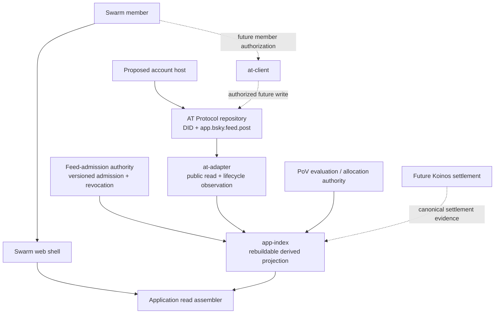

# Proof of Value — Architecture

## Status and product boundary

This is the current boundary map for **Swarm**, the first Proof of Value
marketplace: one feed for people building, testing, documenting, and critiquing
Proof of Value. It describes both the runnable foundation and the boundaries
the repository is preparing to build; it is not a report of live infrastructure.

**Implemented:** runnable Swarm feed contracts and fixtures, a fixture-backed
single-feed shell, the future member-action contract in `@pov/at-client`, and
a locally tested isolated Koinos spike. **Simulated:** the shell's votes and
allocations. **Proposed:** public AT observation, account provisioning, feed
admission/revocation operations, the app index, the application service, and
Koinos settlement. **Blocked:** a live Koinos testnet round trip is unproven.
**Deferred:** a production PDS, OAuth and live posting, moderation operations,
and live settlement.

AT Protocol is canonical for account identity and ordinary public post records.
Swarm owns feed admission, moderation policy, ranking, and PoV views. Koinos
is a separate future settlement path; it is neither the product nor a proven
live dependency.

For the market-entry story, read [docs/product/SWARM_MVP.md](docs/product/SWARM_MVP.md).
For SWARM mechanism details, read [WHITEPAPER.md](WHITEPAPER.md).

## Authority topology

The dotted paths are proposed future operations. The browser must never hold a
PDS administrative credential, provisioning authority, or a broad shared
signing key. A member-authorized AT action is separate from server-side
provisioning; public observation is separate from both. AT content, a Swarm
admission decision, a derived index entry, and a settlement result retain
separate provenance.

## Components and maturity

| Component | Responsibility | Current state |
| --- | --- | --- |
| `packages/protocol` + `packages/application-contracts` | Versioned Swarm facts and browser-safe feed-view contract | **Implemented:** runnable validators and vectors; broader read surface **proposed** |
| `apps/web` | Fixture-backed single-feed shell and provenance display | **Implemented:** local shell; votes and allocations **simulated** |
| `packages/at-client` | Future member-authorized AT actions and reconciliation contract | **Implemented:** dependency-free contract scaffold; network/OAuth **proposed** |
| `packages/at-adapter` | Public read and lifecycle observation only | **Proposed:** package scaffold; no live public reads |
| Proposed account host | Provisioning, custody, recovery, and PDS operations | **Proposed:** no host/PDS selected or operated |
| Feed-admission authority | Versioned admission and revocation facts | **Proposed**; no authority exists |
| `packages/app-index` | Rebuildable projection of observations and admission facts | **Proposed** scaffold; no index exists |
| `packages/application` | Assemble the product read view | **Proposed** scaffold; no service exists |
| PoV evaluation/allocation | Evaluation and allocation provenance | **Proposed**; mockup values are **simulated** |
| Koinos contracts | Future locks, settlement, and claims | **Proposed**; the isolated `spike` is **implemented** local feasibility evidence |
| `design/mockup` | Dual-marketplace visual and interaction research | **Implemented** browser-local historical vision; not active product scope |

## Canonical and derived data

An ordinary Swarm post is intended to be an `app.bsky.feed.post` in the
author's AT repository. A DID-based AT URI identifies the logical record and an
observed CID identifies the evaluated version. An edit must not silently change
an evaluated object.

Swarm does not make its application database the canonical copy of a post. The
feed-admission authority records versioned admission or revocation facts, and
`@pov/app-index` derives a rebuildable view from those facts, AT observations
and lifecycle evidence, and the selected PoV authority. A public post may
exist even when it is not admitted to Swarm; removing it from the feed cannot
erase it from AT Protocol. Koinos, if later connected, remains separately
canonical for settlement—not for content, identity, admission, or ranking.

## Deterministic reconciliation rules

These scenarios are acceptance rules for the proposed middle layers. They do
not claim that the layers are already operational.

| Scenario | Required result |
| --- | --- |
| Successful AT write, index failure | Reconcile the known URI/CID and rebuild or retry the projection; never republish the post. |
| Admission replay | The same versioned admission/revocation fact and idempotency key produce one effective decision, not duplicate admission state. |
| Projection rebuild | The same retained observations, lifecycle facts, and admission facts produce the same projection deterministically. |
| Changed record | The new CID is a new evaluated version with its own admission and visibility state; it inherits neither the earlier admission nor evaluation. |
| Deletion | Retain a minimal tombstone (DID, URI, last known/evaluated CID, lifecycle provenance); do not hydrate text, embeds, or body fields. |
| Inactive, migration, old-PDS, or out-of-order observation | Apply authoritative ordering and current DID-to-PDS resolution. A stale source cannot overwrite newer state or resurrect deleted/inactive content. |
| Index delay | Public/read-side observation remains available with its own provenance; delayed projection must not block direct content reads or imply failed publication. |

## Operational gate before real accounts

No production PDS has been selected or operated. Before Swarm provisions an
account, the project needs an explicit account-hosting review covering custody,
recovery, migration, separate app and PDS domains, backups, PLC recovery keys,
invite and spam controls, moderation and appeals, emergency actions, audit
evidence, and deletion/retention behavior. Future OAuth must use narrowly
scoped, server-held authorization material and bind the returned DID to the
authorized transaction.

## Historical artifacts

The [dual-marketplace mockup](design/mockup/README.md) demonstrates the longer
term idea of many marketplaces sharing one mechanism. The July
[parallel-prototype plan](docs/plans/2026-07-20-001-feat-parallel-prototype-foundation-plan.md)
and [long-term diagram specification](docs/architecture-diagram-spec.md)
preserve the historical Koinos topology. Both remain available, but the
[August market-entry plan](docs/plans/2026-08-04-001-feat-swarm-market-entry-foundation-plan.md)
is the current implementation authority.
