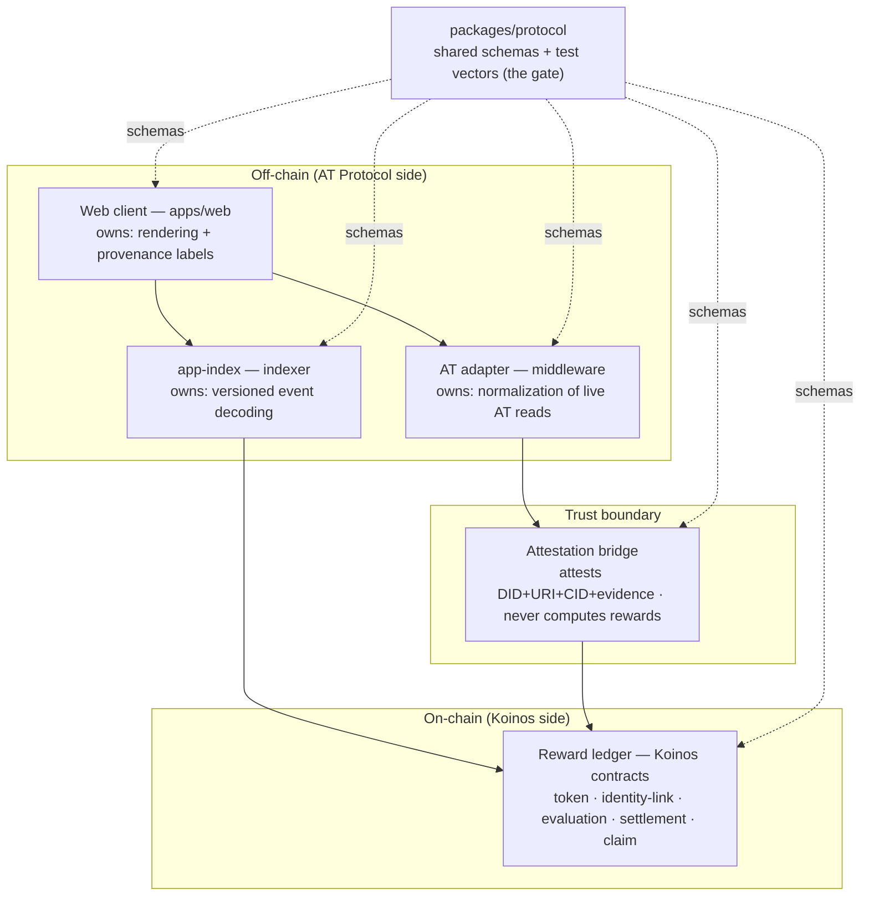

# Proof of Value — Architecture

The system is one deployable monorepo of independently testable components, split
into six layers with a strict dependency order. Content and identity live on **AT
Protocol**; stake-linked accounting and settlement live on **Koinos**; an explicit
**attestation bridge** carries facts between them and is trusted to do nothing
more. This document is the component map; the mechanism itself is specified in
[WHITEPAPER.md](./WHITEPAPER.md) (see §5, "Reference architecture").

> Status: this baseline comes from the "POV Consolidation" compound-engineering
> pass (ce-brainstorm → ce-plan → ce-work, July 2026). The spike contract and web
> client exist; the middle layers are designed and being scaffolded. Each
> component below is a directory with its own README stating its single
> responsibility, so the whole architecture is legible from the repo tree.

## Layers

Data flow: `Web → Application → AT adapter / app-index → Web`. Dependency order:
`contracts → ledger / fixtures / adapters → web`.

## Components

### `packages/protocol` — shared domain (the gate)
The domain schemas and test vectors every other component agrees on: identity,
content reference, vote, reward period, pending allocation, claim. Owning a stable
schema+vector set here lets the other five components be built and tested
in parallel. **Owns: schemas and vectors.**

### AT adapter — middleware
Normalizes live reads from AT Protocol / Bluesky (`public.api.bsky.app`, OAuth
handled server-side). Returns an explicit state for every record —
`live / stale / unavailable / invalid` — and **never** silently falls back to a
fixture. Everything downstream can trust that a record's provenance is labeled.
**Owns: normalization.**

### Attestation bridge — trust boundary
The one deliberately trusted seam. It observes or retrieves an AT record, verifies
the needed evidence, and attests the observed **DID + AT-URI + observed CID +
evidence** to Koinos. It is explicitly forbidden from computing evaluations,
applying the allocation curve, minting, or choosing recipients — those are
deterministic contract logic. Its residual power (it can omit, delay, or
mis-attest) must be observable and replaceable. See WHITEPAPER §5. It is a *role*
realized within the application-service and proof-script layers (U6/U7), not a
standalone package. **Owns: attesting facts, nothing more.**

### Application service + read contract — `packages/application`, `packages/application-contracts`
The application service assembles the product view the client reads —
joining normalized AT records (from the adapter) with pending state (from
app-index) — and has no signing keys. `application-contracts` is the view/read
contract the web client and service agree on, so the frontend can be built against
a stable shape while the service fills in. Built by U6/U2.
**Owns: the product read view.**

### Reward ledger — Koinos contracts (backend)
The on-chain core: upgradeable token, identity-link, evaluation, settlement, and
claim contracts, with deterministic reward accounting. Votes commit a locked stake
fraction; settlement allocates the period's issuance via the convergent curve and
unlocks committed stake; author DIDs accrue rewards and later claim them.
**Owns: command/event conformance.** (A working `spike` contract with a passing
AS-pect test and an emitted/decoded protobuf event already exists.)

### app-index — indexer
A noncanonical read model that reconstructs pending state (locks, evaluations,
allocations) from canonical Koinos events to serve the client and a SWARM-ranked
feed. It is **not** the financial record — the chain is. **Owns: versioned
decoding.**

### Web client — frontend (`apps/web`)
The user-facing client: displays real AT content and Koinos state, supports login,
account linking, voting, and claims, and labels every field with its provenance
(`live / stale / …`). The current mockup in [`design/mockup/`](./design/mockup) is
this layer's starting point (U4 re-homes it into `apps/web`). **Owns: rendering.**

## Build status

| Component | Directory | State |
|---|---|---|
| Protocol / vectors | `packages/protocol`, `spec/` | scaffold |
| Application contracts | `packages/application-contracts` | scaffold |
| AT adapter | `packages/at-adapter` | scaffold |
| Application service | `packages/application` | scaffold |
| app-index | `packages/app-index` | scaffold |
| Koinos contracts | `contracts/koinos/{pov,token,identity}` | scaffold — only `spike` is built + passing test |
| Attestation bridge | `scripts/protocol-proof` (role) | scaffold |
| Web client | `apps/web` (reference: `design/mockup`) | mockup built (standalone); not yet wired into `apps/web` |

Only the `spike` contract (feasibility) and the mockup are built; everything
else is a scaffold. `ROADMAP.md` tracks unit-by-unit status.
Deferred until the loop runs end-to-end: live AT OAuth writes, Koinos
wallet/sponsorship, and deployed contracts on the testnet.

## Provenance

This map consolidates the compound-engineering plan
(`docs/plans/2026-07-20-001-feat-parallel-prototype-foundation-plan.md`, units
U1–U9) and WHITEPAPER §5. That plan is the more detailed source for
implementation sequencing and per-unit acceptance criteria.
