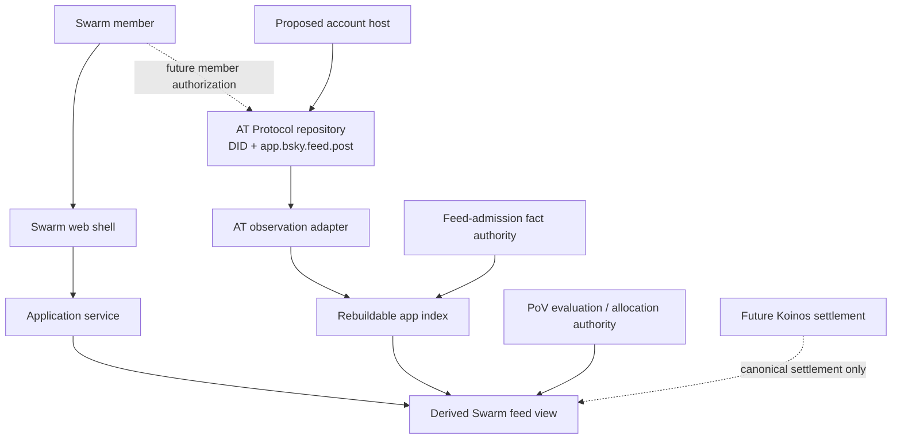

# Proof of Value — Architecture

## Status and product boundary

This is the proposed architecture for **Swarm**, the first Proof of Value
marketplace: one feed for people building, testing, documenting, and critiquing
Proof of Value. It describes boundaries the repository is preparing to build;
it is not a report of live infrastructure.

**Implemented:** a browser-local design mockup and a locally tested Koinos
spike. **Simulated:** the mockup's feed, votes, and allocations.
**Proposed:** the single-feed application and the authority split below.
**Blocked:** a live Koinos testnet round trip is unproven. **Deferred:** account
provisioning, OAuth, PDS operation, live posting, moderation operations, and
live settlement.

AT Protocol is canonical for account identity and ordinary public post records.
Swarm owns feed admission, moderation policy, ranking, and PoV views. Koinos is
the reference future settlement path; it is neither the product nor a proven
live dependency.

For the market-entry story, read [docs/product/SWARM_MVP.md](docs/product/SWARM_MVP.md).
For SWARM mechanism details, read [WHITEPAPER.md](WHITEPAPER.md).

## Proposed authority topology

The dotted paths are proposed future operations. The browser must never hold a
PDS administrative credential, provisioning authority, or a broad shared
signing key. A member-authorized AT action is separate from any server-side
account-provisioning authority. AT content, a Swarm admission decision, a
derived index entry, and a settlement result retain separate provenance.

## Components and maturity

| Component | Responsibility | Current state |
| --- | --- | --- |
| `apps/web` | Future single-feed product shell and provenance display | **Implemented:** placeholder only; single-feed shell **proposed** |
| `packages/at-client` | Future member-authorized AT actions | **Proposed**; not yet created |
| `packages/at-adapter` | Public AT observations and lifecycle normalization | **Proposed** scaffold; no live reads |
| Feed-admission authority | Versioned admission and revocation facts | **Proposed**; no authority exists |
| `packages/app-index` | Rebuildable projection of observations and admission facts | **Proposed** scaffold; no index exists |
| `packages/application` | Assemble the product read view | **Proposed** scaffold; no service exists |
| PoV evaluation/allocation | Evaluation and allocation provenance | **Proposed**; mockup values are **simulated** |
| Koinos contracts | Future locks, settlement, and claims | **Proposed**; the isolated `spike` is **implemented** local feasibility evidence |
| `design/mockup` | Dual-marketplace visual and interaction research | **Implemented** browser-local historical vision; not active product scope |

## Canonical and derived data

An ordinary Swarm post is intended to be an `app.bsky.feed.post` in the
author's AT repository. A DID-based AT URI identifies the logical record and an
observed CID identifies the evaluated version. An edit must not silently change
an evaluated object.

Swarm does not make its application database the canonical copy of a post.
Instead, it will record feed-admission facts separately, then rebuild a derived
feed view from AT observations, admission facts, lifecycle observations, and
the selected PoV authority. A public post may exist even when it is not admitted
to Swarm; removing it from the feed cannot erase it from AT Protocol.

## Operational gate before real accounts

No production PDS has been selected or operated. Before Swarm provisions an
account, the project needs an explicit account-hosting review covering custody,
recovery, migration, separate app and PDS domains, backups, PLC recovery keys,
invite and spam controls, moderation and appeals, emergency actions, audit
evidence, and deletion/retention behavior. Future OAuth must use narrowly
scoped, server-held authorization material and bind the returned DID to the
authorized transaction.

## Historical artifacts

The [dual-marketplace mockup](design/mockup/README.md) demonstrates the longer
term idea of many marketplaces sharing one mechanism. The July
[parallel-prototype plan](docs/plans/2026-07-20-001-feat-parallel-prototype-foundation-plan.md)
records earlier protocol-first sequencing. Both remain available, but the
[August market-entry plan](docs/plans/2026-08-04-001-feat-swarm-market-entry-foundation-plan.md)
is the current implementation authority.
