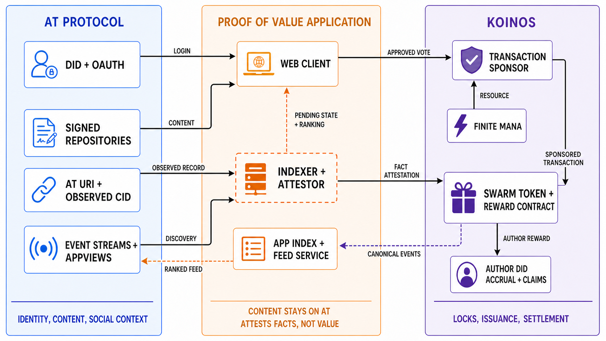

# SWARM: A Stake-Weighted Reward Mechanism for Subjective Information Value
## Proof of Value using AT Protocol and Koinos
**Version 0.4 — private working draft — 24 July 2026**

> This document is a design paper, not an offer, a promise of token value, or an implementation specification. The SWARM mechanism is a proposal; parameters and integration details marked open require design, implementation, and prototype validation.
> 
> **This is a beta, and the token is not the point.** The first SWARM token is a valueless test token. It is not designed to appreciate in value, and no one should participate in the expectation that it will. The development authority explicitly retains the right to change the token economics entirely: Koinos's upgradeable contracts make rapid iteration the purpose of this stage rather than an exception to it. Every such change is announced and versioned, and the authority is subject to the sunset conditions in §9.
## Abstract
Proof of Value provides **turnkey marketplaces for information**. Any organization can deploy one to reward the information its members produce, according to the collective judgment of the people who actually value that information. This matters most for organizations without a center: a company aligns its people with shares, recorded by a registry and enforced by courts, and a state aligns its people with a currency it issues and backs; both instruments presuppose the center that issues them. An organization without such a center has no comparable instrument for rewarding contribution that cannot be objectively measured. The product proposed here is the marketplace, not a token. A token is only the accounting unit a particular marketplace uses to express what its community judged worth rewarding, and the mechanism is deliberately designed so that no one needs to care about its price—or, eventually, needs to know a blockchain is involved at all.

Markets are powerful because a price aggregates the judgments of many people who have skin in the game, but a market can only price what can be directly bought and sold. The internet produces enormous quantities of information—posts, reviews, art, explanations, and the countless smaller social contributions that make a network worth participating in—whose value is real without being captured by any transaction. Social platforms currently monetize that uncaptured value indirectly, through attention and advertising, rather than rewarding it directly. This paper proposes Proof of Value, a token-distribution mechanism that extends economically committed collective judgment to information that markets cannot price directly, informed by the mature Subjective Proof of Work design developed for Steem. Its aim is not an objectively correct valuation but provable fairness: the rules by which judgments are aggregated into rewards are published in advance, applied identically to everyone, settled deterministically, and open to independent inspection, so that what can be demonstrated is the fairness of the process rather than the correctness of the result. Its reference implementation, SWARM—the Stake-Weighted Autonomous Reward Mechanism—defines a predetermined token budget for each reward period and allocates it deterministically at settlement according to stake-weighted upvotes and downvotes.

The paper's principal focus is how a proposed mechanism could combine AT Protocol and Koinos using contemporary social-protocol and smart-contract design. AT Protocol supplies portable identity, signed repositories containing content-addressed records, social context, extensible schemas, and open distribution surfaces. Koinos can support programmable authority and sponsored actions that are free to the sponsored user, while a sponsor bears finite regenerative Mana costs. In the proposal, the information being evaluated remains on AT Protocol: a DID-based AT URI locates a record and an observed CID binds the evaluated content version. An explicit off-chain attestation layer supplies those observed facts and verification evidence to Koinos. It does not calculate payouts, although its selection, omission, timing, or mis-attestation of evidence can influence which outcomes the contract produces. Proof of Value is presented not as a blockchain consensus mechanism or a new theory of token economics, but as a practical architecture informed by historical social-reward lessons and adapted to the open social web.

Casting a vote commits a configurable fraction `q` of the voter's eligible SWARM balance for that reward period. The committed stake remains locked until rewards are distributed, preventing the same tokens from being transferred and reused while their vote is still pending. Protected but bounded downvote capacity allows stakeholders to contest self-dealing and other allocations that violate the community's social contract. At settlement, when positive eligible weight exists, the protocol deterministically allocates the predetermined period budget to eligible authors and unlocks the stake committed by that period's votes; empty-period budget treatment remains a policy parameter. Recipients can use earned SWARM to evaluate future contributions, creating a recursive path through which recognized contributors can help recognize others. Token ownership remains an economic source of influence rather than a universal measure of reputation.
## 1. The problem: decentralization stopped at finance
A blockchain's consensus algorithm is technical infrastructure. It exists to keep an open, transparent, decentralized ledger secure and functioning, and it meters the network's resources by charging for transactions. Introduce a fungible token into that machinery and it aligns the participants of a financial system remarkably well: validators are paid to secure the ledger, users pay to consume its resources, and every incentive in the system can be expressed in the unit the system already accounts for. This is why decentralized finance works. It is also why, more than a decade in, finance remains nearly the only thing that does.

Decentralization was supposed to extend beyond finance on its own—the assumption being that once the infrastructure existed, decentralized organizations, applications, and platforms would follow. They have not. Of the thousands of tokens launched daily, almost none belong to anything meaningfully decentralized, and the projects that tried to carry decentralization into social applications have now largely been abandoned. Each wave concludes that the problem lay somewhere else: in the product, the interface, or the market.

This paper proposes that the missing piece is a kind of **social consensus algorithm**. A technical consensus algorithm establishes what happened—which transactions occurred, in what order, and therefore what the ledger says. A social consensus algorithm would establish something no ledger can record on its own: what a given piece of abstract information is worth. It would do this the way a market does, by aggregating the evaluations of a large number of people who have skin in the game into a signal no individual—however wealthy or well-informed—possesses alone. A price commands confidence not because markets discover some platonic value, but because it reflects exactly that aggregation, each participant judging from a vantage no one else occupies. Nothing performs the equivalent aggregation for the information a market cannot price.

Such an algorithm has requirements a technical one does not. A technical consensus algorithm runs on specialized operators who are paid to participate and can absorb its costs as a cost of doing business. A social consensus algorithm runs on the ordinary judgments of ordinary people, each judgment worth very little against the cognitive, financial, and opportunity costs of any deliberate payment. It must therefore be free to use, demand no expertise, and impose no barriers to entry. A network that charges for every small act of participation cannot host one—not because the fees are too large, but because the act of paying is itself the friction that prevents the judgment from being made at all.

Steem pioneered such a mechanism in its subjective proof of work, and it worked, before failures elsewhere in its design clouded people's minds as to the most innovative feature it contained. Section 3 returns to what that experiment did and did not demonstrate.

A market can only price what can be directly bought and sold. Much of what the internet produces—posts, reviews, art, explanations, and the countless smaller social contributions that make a network worth participating in—has value that is real without being reducible to a market transaction. One person might pay a large sum for a piece of art; a million other people might derive genuine value simply from its existence, even though none of them would or could buy it. That value is captured by no transaction, so it tends to be monetized indirectly instead: through advertising, engagement ranking, subscriptions, patronage, or opaque platform policy, rather than through a direct reward to the people who created it.

Today, information falls into two buckets: information valuable enough that people consciously decide to pay for it, and everything else, which can only be monetized through advertising. But advertising does not really monetize the information at all—it monetizes the creator's ability to attract attention. That mismatch, pricing attention while the thing actually produced is information, creates the unstable dynamic familiar to every ad-funded network: a creator must produce genuinely valuable information to attract an audience, then dilute that value by churning out low-quality, repetitive, repackaged content to monetize as much of that attention as possible, then produce real value again—a wave-like cycle. This paper proposes a marketplace for information that is not based on advertising. It does not exclude the other reward channels (payment, subscription, patronage); it adds direct valuation of information as the foundational one within this application.

Charging directly for that second bucket does not work, and readers should not have to make a separate payment decision at all. Asking someone to weigh the cognitive, financial, and opportunity cost of a micropayment against every piece of information they encounter does not scale, and the abundance of free alternatives means a paywall simply drives readers elsewhere. What does scale is a familiar, low-friction evaluative action people already perform without thinking about it—an upvote or a downvote—aggregated across many people into an economically meaningful reward. Proof of Value asks a narrower question than what something is objectively worth: can a community direct a fixed, shared issuance budget toward the contributions its members judge valuable, using nothing more than that familiar evaluative gesture, while making the basis and consequences of those judgments inspectable?

Subjective judgments cannot be objectively correct. One person may believe a given poem is the most beautiful ever written; another may consider it worthless; neither is wrong. But a valuation can still be arrived at in a way that is provably fair, by aggregating the valuations of many people—the wisdom of the crowd. If we cannot have provable objectivity, then what we settle for is **provable fairness**. We cannot prove that a reward is the correct valuation of a contribution, because no such valuation exists. What we can prove is that the rules producing that reward are fair: published in advance, applied identically to everyone, executed deterministically, and open to inspection and reconstruction by anyone who cares to check. Fairness is a property of the process, not a claim about the result. The answer proposed here is therefore not an objective measure of truth and not a replacement for editorial judgment. It is a mechanism for making subjective evaluation economically consequential—a way to convert low-friction subjective judgments into economically meaningful signals.

Money itself is a kind of information-compression technology, compressing unimaginable quantities of information into a single number; Proof of Value is not a way to discover some objective, Platonic value, but another such information-processing layer, one that helps a community express, aggregate, and transmit its judgments about value. A finite budget creates the need to choose; stake-weighted evaluation gives choices economic cost, the same skin in the game that gives market prices their credibility; negative evaluation permits contest; and deterministic settlement makes the resulting distribution reproducible.

Proof of Value is therefore a **token-distribution mechanism**, and calling it a social consensus algorithm does not make it a blockchain consensus protocol. The two operate at different layers and answer different questions. The chain's consensus orders and validates transactions, establishing what happened; SWARM describes how an application-level budget is allocated after those transactions are accepted, establishing what a community judged worth rewarding. The second depends on the first and cannot replace it.
## 2. What Proof of Value and SWARM mean
**Proof of Value (PoV)** is the project umbrella and the general idea of algorithmically creating and distributing tokens according to subjective judgments of information value.

The evaluated object is information in general. The first client focuses on familiar user-generated content because that is legible to the broadest audience, but nothing in the mechanism restricts evaluation to social posts: a code repository, a smart contract, a dataset, or a review is an equally valid object of evaluation. An AT record can reference any of these.

A **social consensus algorithm** is a decentralized method for leveraging the wisdom of the crowd to value an arbitrary piece of information and to distribute newly issued tokens according to that valuation. It is the general form of what this paper argues is missing; SWARM is one candidate implementation of it. Three properties are constitutive rather than desirable: it must be free to the participant, require no specialized expertise, and impose no barriers to entry. A mechanism failing any of the three cannot collect the volume of ordinary judgments it needs to produce a meaningful signal, however sound its allocation rule.

**SWARM** means **Stake-Weighted Autonomous Reward Mechanism**. It is the version-one reference mechanism. It does not assert that a vote proves value; it defines a transparent process through which holders commit scarce economic influence to allocate a bounded reward budget.

**Subjective value** is what an individual believes something is worth. One person's valuation of a poem, a post, or a piece of art is no more objectively correct than another's.

**Collective valuation** is the aggregate signal produced when many individuals' subjective valuations are combined—an analogue to a market price for information that a market cannot price directly.

**Provable fairness** is the standard by which the resulting allocation is judged. It does not assert that an allocation captures the objectively correct value of a contribution; it asserts that the rules producing that allocation are open, deterministic, applied equally to every participant, and independently verifiable from the public record. What is provable is that the published rules—and only those rules—determined the distribution.

This paper uses provable fairness in a broader sense than blockchain gaming, where "provably fair" refers narrowly to a cryptographic commit-reveal scheme letting a player verify that one random outcome was not altered after the fact. The shared idea is that participants need not trust an operator's word. The difference is that SWARM makes no claim about randomness or about any single outcome being correct; its claim is that the allocation rule is public, the inputs are recorded, and the result can be recomputed by anyone from the canonical event history.

Provable fairness is a claim about each settled period under the rules in force when that period settles. It is not a claim that the rules are permanent. During the beta the development authority may change the mechanism between periods (§9), and a reader should understand the guarantee accordingly: within a period, the published rule and only that rule determined the distribution, and anyone can recompute it; across periods, the rule itself may have changed, and every such change is announced and versioned so the history remains auditable. A mechanism that can be revised is not thereby unfair, but it is only as inspectable as its change record.

Provable fairness so defined applies to the allocation the contract performs on the attestations it accepts. It does not extend to what reaches the contract in the first place: the attestation bridge described in Section 5 can delay, omit, or mis-attest facts, and the sufficiency of emitted events for independent reconstruction remains an open question. Provable fairness is therefore the standard this design is built to meet, not a property already demonstrated by a running system.

The first reference implementation pairs AT Protocol with Koinos. A token name, ticker, market role, monetary policy beyond the prototype, and any claim of exchange value are outside this paper.
## 3. Steem: a confounded experiment
The argument in Section 1 would be speculative if nothing had ever tried it. Something did. Steem ran a continuous, feeless, openly joinable, per-item upvote-and-downvote mechanism that allocated real issuance at social scale, and by the standards that matter for the claim being made here, it worked: content creation and user growth were exponential for a period, and the mechanism demonstrably moved newly issued currency toward what a crowd judged worth rewarding. This paper's central claim is not that such an algorithm is new. It is that the one system to demonstrate it was never evaluated on its own terms.

Steem's collapse is usually treated as a verdict on the reward mechanism. It is better read as a confounded experiment, because its failures fall into two groups that a single post-mortem tends to merge.

The first group belongs to the chain and its governance: content stored on-chain by default, with the state growth that implies; a delegated-proof-of-stake validator set that proved capturable when exchange-held customer stake was voted to replace it; and a founding company holding a large share of the supply, a concentration independent of any allocation curve. These are architectural and constitutional failures. A minimal, feeless, upgradeable chain that stores no content and elects no witness set does not inherit them.

The second group belongs to the reward mechanism itself, and this paper claims no immunity from it. Markets for buying upvotes emerged and made purchased attention more profitable than genuine curation. Large holders voted for their own content. Downvotes were used for retaliation as readily as for contesting abuse. These are properties of stake-weighted continuous voting, not of the ledger beneath it, and changing chains does nothing to address them. They are precisely what the mechanism in Section 4 attempts to revise: a convergent allocation curve rather than the superlinear curve that concentrated early rewards, stake committed and locked until settlement rather than freely reusable voting power, and protected but bounded downvote capacity rather than unlimited flagging. Whether those revisions actually suppress the behavior is the open question this prototype exists to answer, and it is stated as such in Section 13.

One honesty cost deserves naming here rather than in a footnote. Paid curation was itself a major surface for vote-selling on Steem, and version one removes it by paying authors only. But removing paid curation also removes the incentive to evaluate at all, which is a different failure mode with its own history. The prototype trades a known gaming surface for an untested assumption about voluntary evaluation.

Steem showed that newly issued currency can be directed by community evaluation instead of requiring every reader to make a payment. Its later reward work is useful because it treated the system as scarce-resource allocation rather than as a simple popularity counter. The durable lessons are: a predetermined reward budget; influence connected to committed stake; positive and negative evaluations; delayed, deterministic settlement; a configurable allocation curve; and bounded capacity for contesting allocations.

SWARM borrows these functions, not Steem-specific terminology or implementation. In particular, version one does not import a separate regenerating voting resource, persistent staking mode, unstaking cooldown, or curator payout. It proposes an automatic, reward-period lock instead. Its allocation function is informed by Vandeberg's historical convergent-linear proposal and the later protected-downvote design; it is not a claim that current Hive uses that curve. The maintained Hive HF25 source sets author and curation curves to linear.

An allocation curve is not merely a mechanical detail; it expresses a theory of fairness. A linear curve is proportional but vulnerable to stake-splitting; a superlinear curve resists stake-splitting but grows increasingly unfair to large positions; Vandeberg's convergent-linear form (`n²/(n+1)`) is an attempt to hold both properties at once. Most of what is posted attracts little agreement, and scattered, isolated votes are closer to noise than signal. The convergent-linear curve behaves as a noise filter: in its superlinear region, low-consensus contributions receive practically nothing, so the budget is not spread thinly across everything; as independent evaluations accumulate on the same contribution, rewards grow steeply; and the curve's convergence to linear bounds the amplification, so a heavily-voted contribution keeps earning proportionally but its advantage stops compounding. The curve is thus also a claim about how value is distributed—rare, and concentrated where many independent judgments converge—and it is one implementation of fair aggregation, not the reason the mechanism exists. SWARM's exact curve and constants remain proposed parameters requiring simulation and validation.

The lesson from self-voting is broader than “ban self-votes.” Direct prohibitions can be routed around through alternate accounts, reciprocal arrangements, purchased support, or strategies the rule writer did not anticipate. A mechanism needs a way for stakeholders to dispute allocations, while candidly recognizing that the same power can be abused.
## 4. Reference mechanism
Let reward period `t` have a new-SWARM budget `B_t`. `B_t` is set by a fixed inflation rate applied to the outstanding supply rather than by a fixed absolute quantity, so the budget scales with the system instead of shrinking in relative terms as supply grows. A constant issuance rate also has a deliberate secondary effect: holding SWARM idle is diluted by the issuance going to people who are evaluating, so the design rewards use rather than accumulation. For each voter `i`, let `S_i,t` be that voter's eligible SWARM balance snapshot for the period. A standard evaluation commits:

`w_i,t = q × S_i,t`

where `q` is a proposed configurable standard-vote fraction. The proposed commitment is an automatic lock, not a transfer to the author. It cannot be transferred or used by another vote before settlement. It supplies the weight `w_i,t` for the signed evaluation.

For contribution `c`, the contract records signed positive and negative evaluation totals, conceptually:

`N_c,t = max(0, P_c,t − D_c,t)`

where `P` and `D` are the respective weighted totals. A deterministic, nonnegative allocation function `F` transforms each eligible net evaluation into an allocation weight. At settlement:

`R_c,t = B_t × F(N_c,t) / Σ F(N_j,t)`

for eligible contributions `j` with positive allocation weight. This is a SWARM reference formula, not an inherited or deployed default. If there are no eligible positive contributions, the treatment of `B_t` must be specified by policy rather than assumed here. Under the proposed nonnegative-allocation invariant, negative or zero-scoring contributions receive no newly created SWARM and a downvote never confiscates previously earned balance; this invariant must be implemented and tested.

Version one pays `R_c,t` only to the contribution's author DID. The curve above concentrates rewards on consensus, but it acts only after votes exist—it pays no one to search out undervalued contributions before that consensus forms. In version one, a voter commits stake and receives nothing for voting; honest evaluation is economically altruistic. Steem's curation rewards addressed exactly this, paying voters in proportion to the eventual reward of what they voted for early and making discovery a paid activity—but they also created one of Steem's worst gaming surfaces: vote-selling bots and automated front-running of prominent authors. Version one therefore defers curator rewards and treats the question as empirical: whether the prototype produces sufficient honest evaluation without paid discovery is one of the things the prototype exists to find out (open question 9 in Section 13). The contract must perform incremental accounting so settlement does not require iterating over all historical votes; the precise data structures remain an implementation-design question.
### Standard votes and the provisional cadence
`q` is measured against the period snapshot, not the balance remaining after earlier votes. Thus, subject to the available snapshot-derived commitment, successive standard votes have equal weight. As an illustration only, `q = 1/24` permits an account fully available at the start of a provisional 24-hour period to make up to 24 equal-strength standard votes. This is not a promise of one vote per hour, a daily load-balancing claim, or a finalized parameter.

The reward period sets the budget, collection interval, settlement event, and lock duration. The prototype assumption is 24 hours because it is legible to users and follows ordinary activity cycles; duration remains configurable.
### Recursive trust—and its limit
At settlement, an author who receives new SWARM can commit it to future evaluations. Recognition can therefore expand the population able to recognize later contributions: **recursive trust allocation**. This does not make SWARM a reputation score. The mechanism does not inherently distinguish earned from purchased tokens once either is eligible to be committed. Purchased capital can buy influence; concentration remains possible. The recursion is a pathway into influence, not a proof that influence is deserved.
## 5. Reference architecture
> **AT Protocol owns identity, content, social context, and distribution. Koinos owns vote-linked token locks, algorithmic token issuance, deterministic reward accounting, and payouts.**

A price is powerful because it compresses an enormous amount of dispersed information into a single number. The chain's role in this design is to carry that compressed layer—commitments, weights, settled allocations—while the information being valued stays on the open social web, where it can be read, copied, revised, and distributed. Earlier social blockchains stored human-readable text on-chain by default; this design treats that as a category error: the ledger is for the compressed signal, not the raw information.

_Figure 1. Reference architecture. The infographic was generated from the deterministic specification in_ `docs/architecture-diagram-spec.md` _and audited against the flows and trust boundaries below. The prose remains authoritative if a later visual revision introduces a conflict._

AT Protocol provides persistent DIDs, OAuth-based authorized-client login, signed repository records, social context, event streams, AppViews, and feed surfaces. Handles are mutable display names and must be resolved and re-checked rather than used as contractual identity. An evaluated item can be a suitable AT record, including long-form content. For durable accounting, the proposal uses a DID-based AT URI as a locator and preserves the observed record CID and verification evidence as the content-version binding. The URI itself is not content-addressed; records can change or disappear, and repositories permit deletion without tombstones. The initial AT graph supports discovery and context, not contractual eligibility; publication and potential earning do not require advance enrollment.

The proposed SWARM contracts would host token/lock state and reward logic: period budgets, eligible balance snapshots, locked balances, signed evaluations, protected downvote capacity, allocation, author-DID accrual, claims, and canonical events. Koinos provides deterministic contract execution; the issuance schedule, locks, incremental accounting, and settlement algorithm are SWARM code to build and audit. Sponsored transactions can make approved actions free to the sponsored user without requiring that user to hold KOIN, but the sponsor pays finite regenerative Mana. Sponsorship must remain narrowly scoped: it is not authorization for arbitrary transfers or unbounded resource consumption.

An application client displays real AT content and Koinos state, supports AT login, account linking, voting, and claims. A read model called the application index can combine AT metadata with canonical Koinos events to serve a responsive client and a SWARM-ranked feed. It is not the canonical financial record. The prototype ranks content inside a standalone client. A read-only custom feed may later distribute that ranking to AT applications, but AT-side feed distribution is outside the first prototype and a feed alone cannot add voting controls to a standard client.
### The bridge is an explicit trust boundary
A Koinos contract cannot directly resolve or verify AT state. An off-chain attestation bridge observes or retrieves records, verifies the needed AT evidence, and attests an observed DID, record URI, CID, and verification evidence to the contract. The contract then deterministically applies published SWARM rules to accepted attestations. The URI locates the record; the observed CID binds the referenced version. The bridge should expose health, cursor, and attestation history. Streams can have bounded backfill or best-effort delivery, so the bridge needs recovery and reconciliation. The separate application index is only a noncanonical client read model.

The bridge must not calculate evaluations, apply `F`, mint SWARM, select recipients, or determine payout amounts. Those consequences belong to deterministic Koinos contract logic. Even so, the bridge can omit, delay, or mis-attest content unless independently checked. That residual authority must be disclosed, made observable, and designed to be replaceable; it is not erased by calling the system decentralized.
## 6. End-to-end flows
### Register and evaluate
1. The attestation bridge observes or retrieves a candidate AT record, verifies the relevant DID/repository evidence, and preserves the DID-based URI, observed CID, and evidence needed for review.
  
2. The bridge attests those observed facts to Koinos; the contract accepts an attestation according to its published rules rather than directly verifying AT authorship.
  
3. The client shows the content, the relevant period state, available SWARM, locked SWARM, and pending allocation.
  
4. A voter selects an upvote or downvote and authorizes an approved Koinos operation. A sponsor may supply chain-resource Mana within explicit rate and resource limits.
  
5. The reward contract snapshots or uses the period's eligible balance, commits and locks `q × S_i,t`, records a signed positive or negative evaluation, and emits events.
  
6. The application index reflects the pending state from the canonical events.
  
### Settle
1. The issuance schedule makes `B_t` available for the closed period.
  
2. The reward contract applies its deterministic allocation function to eligible net-positive contributions and normalizes their weights.
  
3. It credits the resulting allocations to author DIDs only, according to the configured payout policy.
  
4. It unlocks the SWARM committed by votes in the period. A recipient's newly earned balance may be eligible in a later period.
  
### Link and claim
An author need not link an account before publication or voting. Rewards accrue to the author DID. To claim, the user authenticates control of the DID, receives a nonce-bound challenge naming the intended Koinos account, signs with that account, and submits an accepted link attestation. Replay protection, expiry, replacement, and recovery require explicit protocol rules before implementation.
### Edits and deletions
The evaluated object is a DID-based AT URI paired with an observed CID and verification evidence. A later edit has a new CID and is a distinct evaluated version unless a future policy says otherwise. An AT deletion can remove the record without a tombstone; it does not retroactively erase already recorded Koinos accounting, but neither the URI nor the repository alone guarantees continued availability of the content.
## 7. Downvotes: contestable, bounded allocation
An upvote says, in effect, “allocate more of this period's shared issuance here.” A downvote says, “this pending allocation is inconsistent with what this community intends to reward.” Downvotes are therefore a general contestability mechanism, not merely an anti-spam switch.

Version one uses protected but bounded downvote capacity. The protected reserve matters because otherwise a rational participant may conserve all ordinary capacity for positive allocation. The bound matters because negative evaluation can become retaliation, factional warfare, incumbent protection, or suppression of unpopular speech. Its configured size, relationship to ordinary voting capacity, and the exact way it is consumed require final mechanism specification. In all cases, negative evaluation affects pending new issuance only; it must not seize earlier balances.
## 8. Threat model and governance limits
SWARM changes incentives but does not solve social coordination or plutocracy. The relevant threats and limits include:

- **Capital concentration and purchase:** larger holders, including purchasers, can commit more weight, and within a single token concentration remains possible; locking prevents immediate reuse but does not equalize ownership. The design's answers are contest and exit: bounded downvote capacity lets stakeholders contest allocations from within, and because the mechanism is not a monopoly, a community that regards a token's allocation as captured can launch a parallel token under the same mechanism (Section 12) rather than petition the incumbent. Concentration can capture a token; it cannot capture the mechanism. The deeper cost of concentration is that the value of collective valuation comes from aggregating many independent vantages; a mechanism dominated by a few holders is measuring fewer perspectives, which degrades the very signal the mechanism exists to produce.
  
- **Collusion and self-dealing:** reciprocal voting, alternate accounts, and paid support can redirect issuance. Downvotes permit contest but cannot guarantee a correct outcome.
  
- **Bridge error or censorship:** an attestor can delay, omit, or mis-map facts. Attestation transparency, correction rules, and independent verification are required.
  
- **Sponsor abuse:** free-to-user actions can be spammed or used to reach arbitrary contract paths unless authorization, resource, and rate limits are narrow.
  
- **Contract upgrades:** Koinos platform functionality is contract-implemented and upgradeable without a hard fork, but that does not automatically make a PoV contract upgradeable. A PoV contract's upgrade design, code/address, controller identity, process, parameter changes, and event history must be explicit.
  
- **Identity and recovery failures:** DID resolution, account-link replacement, replay, and compromised credentials can produce incorrect claims without carefully defined recovery rules.
  
- **Indexing and interface capture:** a feed or client can hide content even if it cannot alter canonical payouts. Independent read models and event reconstruction reduce, but do not remove, this risk.
  

No claim of “decentralized purity” follows from this architecture. The design makes authority boundaries legible so they can be constrained, audited, and improved.
## 9. Bootstrap and initial distribution
The prototype uses one valueless SWARM test token on a Koinos test network. Test networks are restartable and their endpoints change—the documented Harbinger endpoints are no longer served, and a community-operated testnet has replaced them—so the implementation must retrieve and disclose the current chain ID at runtime rather than hard-code one or imply permanence.

The first token is earned, not sold. A small group receives SWARM only by contributing to the project, and no initial allocation is purchasable. This is what makes the base token suitable as the reserve that later marketplaces launch against (§12): it enters through contribution rather than through a sale that would select for buyers hoping to resell. Initial distribution must still be disclosed in full before any live evaluation period, including who receives initial voting influence, under what limits, and what disclosures apply to operators and early recipients.

This stage is explicitly a beta. The development authority retains the ability to change the mechanism and its economics entirely, using Koinos's contract upgradeability; rapid revision in response to what the prototype reveals is the purpose of this stage. That authority is a concentration of power, not a technicality: it must publish who controls it, announce and version every change, and state the conditions under which it is sunset or transferred. A participant should assume the rules can change, which is one more reason this token is not an investment and should not be treated as one.

The bootstrap objective is to test the complete loop—not to establish price, liquidity, or a reserve asset. An initial allocation should therefore be small, inspectable, and sufficient to exercise both positive and negative evaluation. It should not imply a public sale, investment return, or monetary value.
## 10. Prototype boundary
The first prototype proposes to demonstrate real information hosted on AT Protocol, AT login, Koinos account linking, sponsored upvotes and downvotes, vote-linked locks, deterministic reward accounting, author-DID accrual, claims, and ranking inside the standalone PoV client. Returning that ranking to AT distribution surfaces is deferred. The intended boundary is Harbinger testnet, using its then-current chain ID, and one valueless token.

It does not host social information, build a general social network, launch mainnet economics, create multiple currencies, add an AMM, establish a DAO, raise funds, create a separate reputation score, or claim that collusion has been solved. Exact wallet, authorization, attestation, contract, and recovery choices remain genuine implementation-design questions.
## 11. Related work
Allocating a shared budget according to collective judgment is not a new idea, and this paper claims no priority for it. Several mature systems do exactly that, and an honest account of what is and is not novel here matters more than a claim of originality.

| System | Allocation | Cadence | Cost to participant | Participation | Where judgment centralizes |
|---|---|---|---|---|---|
| Quadratic funding | Matching pool weighted by number of contributors | Discrete rounds | Donation plus gas | Open to donate; projects curated | Round operator sets the eligible-project list |
| Retroactive public goods funding | Appointed reviewers score completed work | Discrete rounds | None to the reviewer | Closed reviewer set | The reviewer set itself |
| Reputation-weighted budgets | Non-transferable reputation earned from approved work | Continuous | Varies | Gated by task approval | Whoever approves tasks and sets payouts |
| Peer allocation within circles | Fixed per-member allocation given to peers | Discrete epochs | None to allocate | Closed, admin-configured membership | Admin sets membership and budget |
| Contribution-graph scoring | Algorithmic scoring of a contribution graph | Continuous scoring | None | Open in principle | Maintainers hand-tune the scoring weights |
| Vote-escrow emission gauges | Locked-token voting directs emissions | Continuous, weekly settlement | Gas per vote | Open to anyone holding the token | Governance whitelists eligible gauges |
| Subjective proof of work (Steem lineage) | Stake-weighted continuous up/downvotes over a fixed issuance | Continuous, per item | None | Open | Elected validator set, outside the reward rule |

Two observations follow. First, every one of these systems reintroduces a locus of judgment somewhere—a curated project list, an appointed reviewer set, an administrator, a hand-tuned weight, a governance whitelist. This paper does not escape that, and Section 5 identifies its own such locus explicitly: the attestation bridge, the sponsor, the initial distribution, and the upgrade authority. A design that claims to have removed every center has usually just failed to look for its own.

Second, the property this paper treats as constitutive—continuous, free to the participant, open to anyone, and expressed per item in both directions—is satisfied by exactly one row, and that row is this paper's own ancestor. Among systems outside the Steem lineage, none combine all four: the funding rounds are periodic and gated, the peer-allocation systems are closed circles, and the gauge systems charge for every vote. That is the honest shape of the contribution. SWARM is not a new category of mechanism. It is a controlled re-run of the one experiment that demonstrated the category, on infrastructure chosen so the experiment can be evaluated on its own terms.

Some inherited components should be named as inherited. A regenerating, stake-proportional resource allowance that makes participation free is the same idea as Steem's resource credits; the convergent allocation curve belongs to the same family as the curve Steem adopted in its later revisions. Neither is presented here as an invention.

AT Protocol contributes portable identity and an open social-data architecture. Koinos contributes a programmable-chain setting with Mana resource accounting, payer/payee sponsorship, programmable authority, and contract-based platform upgradeability. These systems are inputs to the reference design, not endorsements or guarantees that every proposed SWARM integration is already available in the required form.

The requirements are structural; the host is not. What the mechanism needs from a chain is that participation cost nothing at the point of use, that a sponsor be able to bear that cost within bounded limits, and that the contracts be upgradeable while the mechanism is still being learned. Koinos satisfies these directly, which is why it is the reference implementation and the first testbed. It is not the only chain that could: execution costs elsewhere have fallen far enough that sponsored, effectively free participation is becoming practical on several networks, and any chain meeting the three requirements is a candidate host. Nothing in SWARM's allocation rule, lock semantics, or event model depends on Koinos specifically, and the design should be read as portable by intent. The claim of this paper is about what the mechanism requires, not about which ledger provides it.
## 12. Plural marketplaces: the product
The preceding sections describe one marketplace. The product is the ability to create them.

People form higher-level bodies—communities, companies, cooperatives, nations—by sharing information, and each such body has its own idea of what information is valuable. A research collective, an open-source project, a trade association, and a neighborhood do not agree about what deserves reward, and they should not have to. The intended end state is that any such body can stand up its own information marketplace—its own token, its own budget, its own parameters—without negotiating for a place in someone else's ranking system. That is what "turnkey" means here, and it is the sense in which this is infrastructure for decentralized organizations rather than an application with users.

Plurality is also the systemic check on capture described in Section 8. A community that judges its marketplace captured can leave and run another under the same mechanism: exit, alongside the downvote's voice. Concentration can capture a token; it cannot capture the mechanism. The base SWARM token is intended to become the reserve the later marketplaces launch against, which is why it is earned by contribution rather than sold (§9).

Plurality introduces real costs: fragmentation, governance complexity, liquidity questions, and opportunities for confusion or extraction. Making the base token a reserve gives it value-accrual, and value-accrual is exactly where speculative pressure would concentrate—so the invisible, low-stakes experience intended for ordinary participants belongs at the individual marketplace layer, not at the reserve layer. These tensions are unresolved and are named here rather than deferred silently.

Version one therefore ships one marketplace, not the factory. It defers token factories, user-configurable mechanisms, AMMs, formal reserve-asset roles, and cross-currency routing. The first task is to make one complete mechanism intelligible and testable; a factory for mechanisms nobody has validated would only multiply the unvalidated part.
## 13. Open questions
The following require explicit resolution before a production implementation or publication as a final specification:

1. What exact issuance rate, curve constants, downvote-reserve percentage, payout policy, period duration, and `q` are justified by evidence and simulation?
  
2. What is the smallest on-chain representation of an AT URI, CID, and author DID, and can registration be safely combined with a first vote?
  
3. Which evidence does an attestor submit, can independent attestors provide equivalent evidence, and how are incorrect or censored attestations corrected without rewriting history?
  
4. Which Koinos authorization and wallet flows safely support narrowly scoped sponsorship, account linking, and recovery?
  
5. Which events are sufficient for an independent indexer to reconstruct issuance, locks, evaluations, allocations, and claims?
  
6. How should an empty eligible set, insufficient snapshot-derived balance, vote changes, duplicate content references, and conflicting DIDs be handled?
  
7. What bootstrap distribution and upgrade-controller policy are legitimate for a test and how are they sunset, reviewed, or replaced?
  
8. What adversarial simulation and user research are necessary before economic parameters are promoted beyond a prototype?
  
9. Does the version-one mechanism produce sufficient honest evaluation without paid discovery, or do curator rewards need to be reintroduced—and can that be established from prototype behavior before economic parameters are promoted?
  
10. Which transfer restrictions, if any, should apply to earned SWARM, and who decides them? Version one deliberately takes no position. A restriction chosen now would encode a guess about a problem a valueless test token does not yet have, and the question properly belongs to whatever community of maintainers emerges rather than to the initial authors.
  
11. Is a settlement-period lock sufficient skin in the game? A vote immobilizes stake until settlement, but the voter bears no loss for having voted badly: nothing resolves, and no gain or loss attaches to the judgment itself, unlike a position in a prediction market. Whether locked opportunity cost alone is enough to produce careful evaluation is untested.
  
12. Does the revised mechanism actually suppress the failure modes that buried Steem? Vote-selling markets, self-dealing by large holders, and retaliatory downvoting are properties of stake-weighted continuous voting rather than of the chain beneath it (§3). The convergent curve, the settlement-period lock, and bounded downvote capacity are attempts to suppress them; none is yet demonstrated.
  
13. Does the mechanism survive cheap synthetic content and automated evaluation? Nothing in this design establishes personhood, and nothing prevents a holder from delegating evaluation to agents optimized to capture issuance. Whether stake-weighted judgment still carries signal when both production and evaluation are model-mediated is open (§8).
  
## 14. Conclusion
SWARM proposes a modest but consequential separation of concerns: open social identity and information on AT Protocol; deterministic, stake-linked accounting and settlement on Koinos; and an explicit bridge that carries facts rather than deciding value. A fixed period budget, locked vote-linked stake, signed positive and negative evaluations, nonnegative author-only allocations, and settlement-time unlock together create a concrete way to make subjective judgments distribute shared issuance.

The mechanism is not neutral, objective, or immune to capital and social power, but at root it prices information that markets cannot. Its value lies in making its allocation rule and its authorities visible, contestable, and testable. The next standard is not rhetoric about decentralization; it is a prototype that completes one cross-protocol reward cycle with inspectable events and clearly bounded trust.
## References
1. Vandeberg. [Reward Curve Deep Dive](https://steemit.com/steem/@vandeberg/reward-curve-deep-dive).
  
2. Vandeberg. [Downvote Pool Deep Dive](https://steemit.com/steem/@vandeberg/downvote-pool-deep-dive).
  
3. OpenHive Network. [Hardfork logic (HF21 and HF25)](https://github.com/openhive-network/hive/blob/master/libraries/chain/database_hardfork.cpp).
  
4. OpenHive Network. [Reward-curve implementation](https://github.com/openhive-network/hive/blob/master/libraries/chain/util/reward.cpp).
  
5. OpenHive Network. [Protocol configuration](https://github.com/openhive-network/hive/blob/master/libraries/protocol/include/hive/protocol/config.hpp).
  
6. AT Protocol. [Protocol overview](https://atproto.com/specs/atp).
  
7. AT Protocol. [DID specification](https://atproto.com/specs/did).
  
8. AT Protocol. [Repository specification](https://atproto.com/specs/repository).
  
9. AT Protocol. [AT URI scheme](https://atproto.com/specs/at-uri-scheme).
  
10. AT Protocol. [OAuth specification](https://atproto.com/specs/oauth).
  
11. AT Protocol. [Event Stream specification](https://atproto.com/specs/event-stream).
  
12. AT Protocol. [Sync specification](https://atproto.com/specs/sync).
  
13. Koinos Documentation. [Mana overview](https://docs.koinos.io/overview/mana/).
  
14. Koinos Documentation. [Resource management](https://docs.koinos.io/developers/resource-management/).
  
15. Koinos Documentation. [Payer/payee semantics](https://docs.koinos.io/developers/payer-payee/).
  
16. Koinos Documentation. [Authority](https://docs.koinos.io/developers/authority/).
  
17. Koinos Documentation. [Smart contracts overview](https://docs.koinos.io/overview/smart-contracts/).
  
18. Koinos Documentation. [Deploying a contract](https://docs.koinos.io/developers/deploy-contract/).
  
19. Koinos Documentation. [Testnet](https://docs.koinos.io/developers/testnet/).
