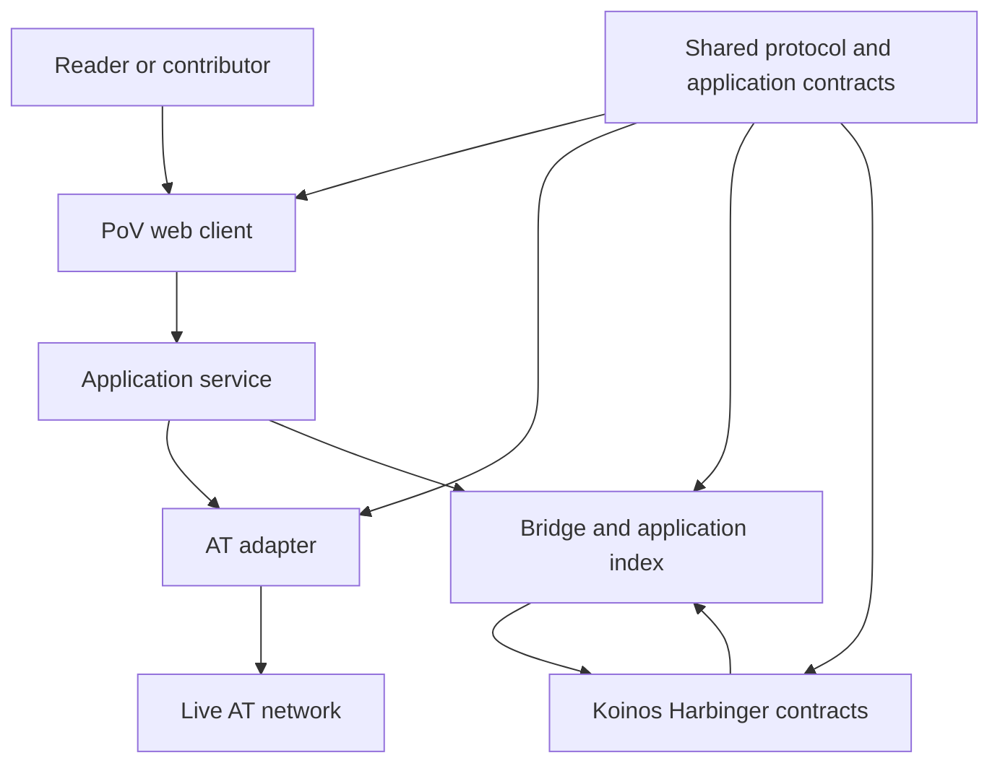
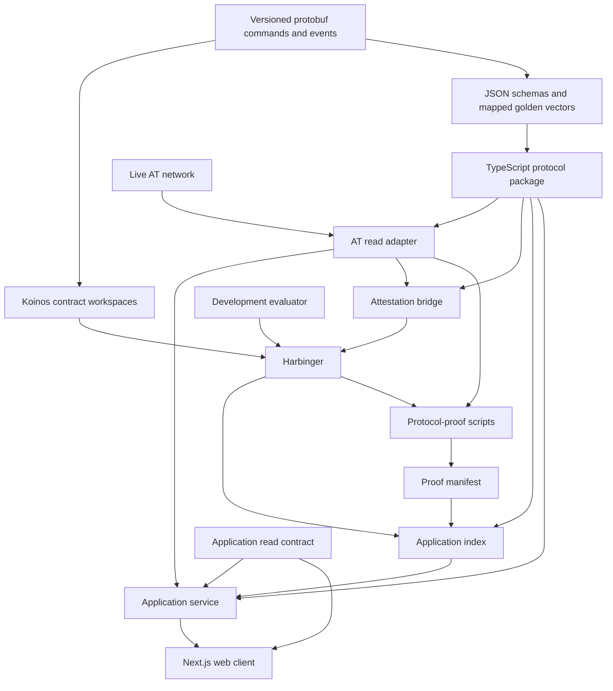
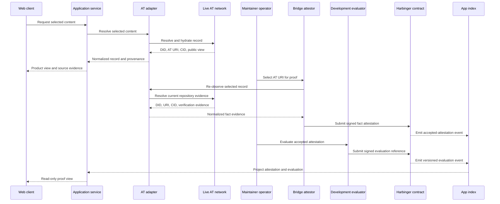
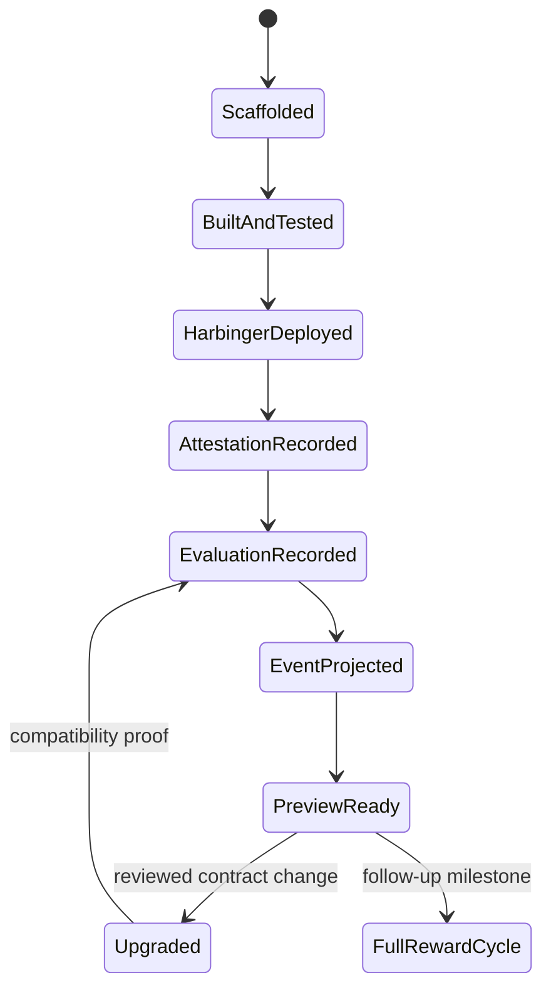
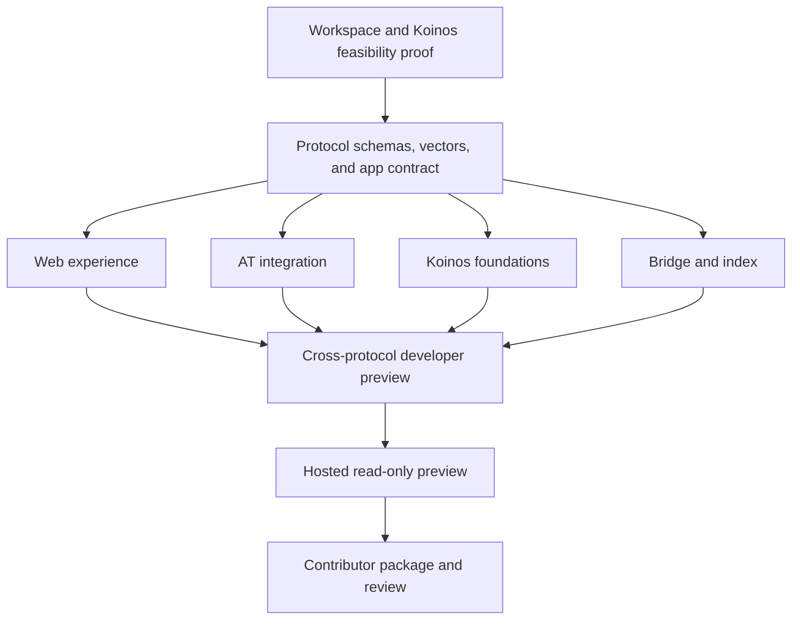
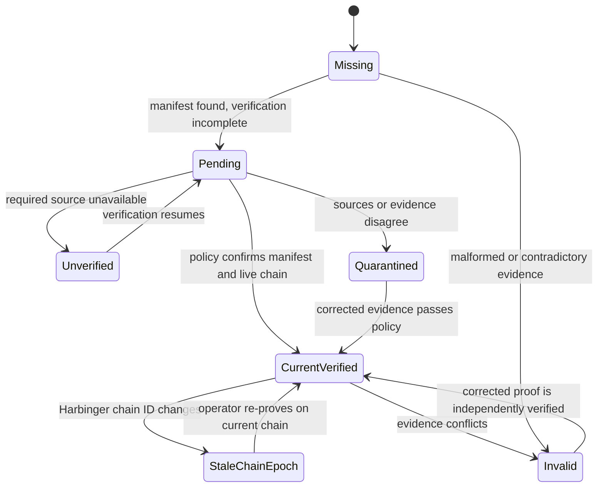

# PoV Parallel Prototype Foundation - Plan

> **Superseded for current market-entry sequencing.** The August 2026 Swarm
> Market Entry Foundation plan is now authoritative for the first product:
> one self-referential feed with ordinary AT social posts and PoV views. This
> July plan remains protocol-history and vision evidence; its live cross-
> protocol proof and dual-marketplace preview are not the current MVP.

## Goal Capsule

- **Objective:** Produce a collaboration-ready PoV developer preview that makes the product vision compelling, demonstrates credible implementation on AT Protocol and Koinos, and gives prospective contributors clear places to engage.
- **Product authority:** `WHITEPAPER.md` version 0.3 defines the mechanism and trust boundaries; `docs/architecture-diagram-spec.md` defines the system topology; this plan defines the first contributable implementation slice.
- **Execution profile:** Prove the isolated Koinos toolchain on Harbinger first, then advance the web experience, AT integration, bridge/index, and contract foundations in parallel against shared protocol and application contracts.
- **Protocol proof:** Display a real public AT record, attest its DID-based AT URI and observed CID on Koinos Harbinger, record a separately authorized evaluation referencing that attestation, and project both events back into the web client.
- **Stop conditions:** Stop and report evidence if the maintained Koinos toolchain cannot compile or deploy the minimal contract, Harbinger is unavailable, or the public AT path cannot preserve URI/CID provenance without violating the white paper.
- **Tail ownership:** Keep the repository private and collaboration-oriented; ship a signer-free read-only preview for prospective collaborators, while real-user rollout, public launch, and production operations wait for developer review.

---

## Product Contract

### Summary

Build a polished, protocol-grounded developer preview rather than a simulated finished product.
The repository should let another developer understand the vision, run the web experience, inspect early contracts and adapters, reproduce a thin cross-protocol proof, and identify useful contributions.

### Problem Frame

The repository currently explains PoV but does not provide an executable product surface.
The standalone mockup communicates a useful feed interaction, yet its browser-local state and hard-coded reward calculation cannot demonstrate that the design fits AT Protocol or Koinos.
A complete user beta would require premature decisions about economics, wallets, sponsorship, persistence, and operations before other developers have reviewed the foundations.

### Key Decisions

- **Collaboration-ready foundation before user beta.** The first implementation should demonstrate the vision, engineering boundaries, and real protocol feasibility well enough to recruit developers; it does not need every product flow to operate end to end. (session-settled: user-directed — chosen over completing a functional user beta first: the immediate goal is to refine the vision and recruit technical collaborators.)
- **Protocol-grounded evidence over product simulation.** Test fixtures may prove deterministic behavior, but product credibility comes from code that reads or writes the actual protocols. (session-settled: user-directed — chosen over simulation-first validation: protocol implementations expose the constraints that matter.)
- **Parallel tracks after two narrow gates.** The web experience, AT adapter, bridge/index, and Koinos foundations advance concurrently after the Koinos feasibility proof and shared protocol/application contracts land. (session-settled: user-directed — chosen over a sequential component build: the project needs visible progress and early feedback across its major surfaces.)
- **The feed is the primary product screen.** Existing AT content with upvote, downvote, comment, score, and reward context remains the main expression of the product; protocol and wallet details support that experience.
- **Authors receive the first rewards.** The first mechanism pays authors only; curator rewards remain outside the initial contract design. (session-settled: user-directed — chosen over adding curator rewards initially: author-only distribution keeps the first mechanism legible.)
- **Voting stake stays locked through distribution.** An evaluation autonomously locks a configurable fraction of PoV stake until its reward period settles, without a separate unstaking cooldown. (session-settled: user-directed — chosen over a post-settlement unstaking cooldown: the white paper and prototype should keep the lock lifecycle simple.)
- **Upgradeable Koinos contracts support learning.** A disclosed founder-controlled development authority may upgrade the Harbinger contracts during this stage; event and state versions must make changes inspectable. (session-settled: user-approved — chosen over freezing the mechanism before external review: early contract design should evolve through developer feedback and later low-stakes use.)
- **Protocol authorities remain separate.** AT Protocol remains authoritative for identity, content, and social replies; Koinos remains authoritative for authorization, locks, settlement, and token balances; the application index is derived.

### Actors

- A1. **Reader or voter:** discovers content, evaluates a post, comments, and inspects voting power.
- A2. **Author:** owns an AT Protocol record and may eventually receive value before linking a Koinos account.
- A3. **Prospective contributor:** evaluates the architecture, runs the project, reproduces the protocol proof, critiques decisions, and chooses a workstream.
- A4. **AT services:** provide DIDs, content records, record versions, public views, OAuth, and social replies.
- A5. **PoV bridge and index:** normalize cross-protocol facts and assemble a queryable product view from AT and Koinos data.
- A6. **Koinos contracts:** record upgradeable PoV state and events on Harbinger, with later milestones completing locks, settlement, and claims.
- A7. **Development upgrade authority:** controls prototype contract upgrades and publishes the active version and compatibility notes.

### System Boundary



The client reads a combined view from the application service.
The thin protocol proof uses real AT content and a real Harbinger event, while unfinished reward and identity flows remain visible design surfaces rather than fabricated protocol state.

### Requirements

**Product experience**

- R1. The primary screen presents a ranked feed of AT Protocol content with visible author identity, content-version context, upvote, downvote, comment, PoV score, and pending reward information.
- R2. The product design previews how one accepted evaluation per content version and reward period locks voting power until settlement.
- R3. Commenting is presented as an AT Protocol social action; until live write authorization lands, the interface must identify it as unavailable or design-only rather than creating a PoV-only comment network.
- R4. Post detail distinguishes the DID-based AT URI from the exact observed CID being evaluated.
- R5. Wallet and reward views distinguish available stake, locked stake, pending allocations, claimable balances, and claimed balances, and identify which values are implemented versus proposed.

**Shared domain and component boundaries**

- R6. All tracks share stable definitions for DID, Koinos address, AT URI, CID, content reference, attestation, reward period, signed evaluation, stake lock, allocation, claim, protocol event, and source provenance.
- R7. The web client consumes application interfaces rather than importing AT SDK types, Koinos client types, fixture stores, or contract implementation details.
- R8. Protocol adapters normalize external values into shared contracts and reject invalid, stale, or unavailable observations without silently substituting demo data.
- R9. Each track has an independently runnable verification surface, and the repository includes one reproducible proof linking a real AT content version to a Harbinger fact attestation and referenced evaluation.

**AT bridge and application index**

- R10. The AT adapter retrieves a deliberately narrow public feed, preserves the observed CID, and represents records that are updated, deleted, malformed, or temporarily unavailable.
- R11. The identity bridge specifies a verifiable DID-to-Koinos link, its evidence, expiration, replay protection, and rotation states even if live OAuth and wallet linking remain a later milestone.
- R12. The application index combines normalized AT metadata and versioned Koinos events without claiming canonical authority over token balances or contract state.
- R24. A versioned fact attestation carries the observed DID, AT URI, CID, and verification evidence into Koinos under a disclosed attestor authority; a separately authorized evaluation references an accepted attestation rather than supplying those facts itself.

**Reward ledger and authorization**

- R13. The reward contract design deterministically locks a configured share of an eligible balance when an evaluation is accepted and releases it when the associated reward period settles.
- R14. Settlement floors negative content scores at zero, divides a configurable author pool among positive scores, issues nothing when the eligible set is empty, and accrues unlinked rewards to the author's DID.
- R15. The claim design requires proof of the author DID and authorization by the intended Koinos account without rewriting historical attribution.
- R16. Sponsorship may pay network-resource costs, but it must not replace user authorization or expose an unrestricted development key.

**Truthfulness and inspectability**

- R17. Every displayed content, identity, evaluation, reward, and link-state group identifies whether it is design-only, test-fixture, live AT, indexed Harbinger, or canonical contract state.
- R18. A developer can inspect the content reference, protocol version, fact attestation, evaluation reference, both emitted events, index projection, and displayed provenance for the thin protocol proof.

**Collaboration readiness**

- R19. A new contributor can clone the repository, run the web experience, build and test the contracts, and reproduce the protocol proof from documented prerequisites.
- R20. The repository maps each component's implemented, protocol-verified, designed, and deferred capabilities without presenting the map as product completion state.
- R21. Architecture, protocol schemas, design rationale, open questions, and contribution guidance give prospective collaborators enough context to propose changes without reconstructing earlier sessions.
- R22. A collaborator-accessible hosted preview exposes the feed and proof evidence in read-only mode without deploying attestor, evaluator, or upgrade credentials or any credentialed operator route.
- R23. Before the first external contribution is accepted, the repository declares its outbound license and inbound contribution terms.

### Key Flows

- F1. Record and inspect a real AT evaluation proof
  - **Trigger:** A maintainer selects a real public AT record for the protocol proof and initiates the authorized operator flow.
  - **Actors:** A3-A7
  - **Steps:** The trusted bridge re-observes the record and submits a versioned fact attestation for its DID, AT URI, CID, and evidence; a separate development evaluator submits a bounded evaluation referencing the accepted attestation; the index projects both events; ordinary readers inspect their relationship through the read-only web experience.
  - **Outcome:** The web experience shows that the exact AT content version was attested and then evaluated on Harbinger, identifies both authorities, and does not imply that public readers performed either write.
  - **Covered by:** R1, R4, R6-R10, R12, R17-R19, R24
- F2. Explore the intended reward experience
  - **Trigger:** A1 opens evaluation, wallet, settlement, comment, or claim controls that are not yet protocol-complete.
  - **Actors:** A1-A3
  - **Steps:** The interface explains the intended state and marks the capability as implemented, protocol-verified, design-only, or deferred; it never fabricates a successful external action.
  - **Outcome:** The product vision remains demonstrable without confusing design exploration with live state.
  - **Covered by:** R2-R3, R5, R11, R13-R17, R20-R21
- F3. Reproduce and critique the protocol proof
  - **Trigger:** A3 follows the contributor setup and proof guide.
  - **Actors:** A3-A7
  - **Steps:** The contributor runs the web app, retrieves a documented AT record, builds and tests the contract, inspects the Harbinger evaluation, verifies the projected event, and reviews the open design questions. An authorized maintainer may separately reproduce the write.
  - **Outcome:** The contributor can distinguish verified implementation from proposal and can identify a concrete collaboration path.
  - **Covered by:** R6-R12, R17-R21
- F4. Upgrade the prototype contract
  - **Trigger:** A reviewed contract change needs Harbinger validation.
  - **Actors:** A3, A6, A7
  - **Steps:** The development authority builds the next version, verifies state and event compatibility, deploys the upgrade, records the version and rationale, and reruns the protocol proof.
  - **Outcome:** The prototype evolves without silently invalidating stored content references or indexed events.
  - **Covered by:** R6, R9, R12-R18, R20-R21

### Acceptance Examples

- AE1. **Covers R4, R9, R18, R24.** Given a public AT record resolves to a DID-based URI and CID, when the bridge attests those facts and a separate evaluation references the accepted attestation, then the indexed events and detail screen show the same URI, CID, authorities, contract version, and Harbinger transaction evidence.
- AE2. **Covers R8, R10, R17.** Given an AT record is malformed, deleted, or temporarily unavailable, when the adapter attempts hydration, then it returns an explicit unavailable or invalid observation and the client does not replace it with fixture content.
- AE3. **Covers R3, R17, R20.** Given live AT write authorization is not implemented, when a user opens the comment action, then the interface identifies the intended AT reply behavior and does not claim that a reply was published.
- AE4. **Covers R13-R14.** Given contract test vectors contain positive, negative, duplicate, period-closed, and empty-eligible-set cases, when the reward logic is tested, then accepted locks, rejected evaluations, nonnegative allocations, zero issuance, and unlock behavior are deterministic.
- AE5. **Covers R19-R22.** Given a developer has the documented runtimes, when they follow the getting-started and protocol-proof guides, then they can run or open the feed, build the contracts, verify public proof evidence, and locate unresolved work without private session context; only the maintainer reproduction step requires write credentials.

### Success Criteria

- The repository communicates the product vision through a polished feed and post-detail experience using real public AT content.
- A developer can trace one exact AT URI/CID through a Harbinger fact-attestation event, a referenced evaluation event, and the application index.
- The trace shows a fact attestation and a separately authorized evaluation, preserving the bridge's fact-only authority.
- The PoV contract implements the versioned evaluation and event path, while token and identity contracts compile as bounded foundations with explicit interfaces and authorization tests.
- Frontend, AT, index, and contract contributors can work independently against shared protocol schemas and golden vectors.
- Setup, architecture, maturity, roadmap, and open-question documents make the private repository suitable for soliciting technical review and collaboration.
- A prospective collaborator can open a hosted read-only preview without receiving any operational credential.
- No UI, API, document, or demo represents design-only or test-fixture state as live protocol state.

### Scope Boundaries

**Included in the collaboration-ready preview**

- Import and refine the existing feed, post-detail, and wallet mockup.
- Replace static feed content with a narrow real public AT read path while preserving an intentional design-demo mode for UI work.
- Define protobuf commands and events for the Koinos boundary, JSON schemas for off-chain views and provenance, and golden vectors that verify their mapping.
- Create an upgradeable PoV attestation/evaluation contract plus bounded, compiling token and identity foundations with deterministic tests.
- Deploy or interact with a minimal PoV contract on Harbinger and project one real fact attestation plus its referenced evaluation into the web client.
- Publish a signer-free, read-only hosted preview for prospective collaborators.
- Add contributor setup, architecture, maturity, roadmap, protocol-proof, contribution-terms, and open-question documentation.

**Deferred to follow-up work**

- Production AT OAuth sessions, live reply publication, repository writes, firehose ingestion, and broad discovery.
- A production browser-wallet flow, automatic account creation, Mana sponsorship, relayer security, and account recovery.
- A complete deployed vote-lock-settlement-claim cycle and economically meaningful parameter selection.
- Production persistence, moderation operations, analytics, notifications, creator outreach, and a Bluesky custom feed.
- Public launch, broad promotion, and low-stakes user recruitment; the collaborator-facing read-only preview is not a user beta.

**Outside this product's identity**

- Hosting social content or building a general-purpose social network.
- Mainnet economics, token sales, exchanges, AMMs, fundraising, or promised monetary value.
- User-created currencies, general DAO tooling, or a claim that PoV is a universal reputation score.

### Dependencies and Assumptions

- The public AT AppView remains available for unauthenticated reads and returns DID-based AT URIs and observed CIDs.
- Koinos Harbinger remains available and the current AssemblyScript SDK can build and deploy a minimal contract after a bounded toolchain spike.
- A development account may sign the initial Harbinger proof; browser-wallet selection and user custody are not required for this stage.
- The existing mockup supplies visual direction, not protocol or economic authority; U1 captures its authoritative source and assets in the repository before U4 depends on them.
- Test fixtures and golden vectors are allowed only as verification artifacts or clearly identified design-demo inputs.

### Sources

- `WHITEPAPER.md`
- `docs/architecture-diagram-spec.md`
- `docs/source-audit.md`
- `assets/proof-of-value-architecture.png`
- [AT Protocol OAuth specification](https://atproto.com/specs/oauth)
- [AT Protocol reading guide](https://atproto.com/guides/reading-data)
- [AT Protocol writing guide](https://atproto.com/guides/writing-data)
- [Bluesky OAuth client guide](https://docs.bsky.app/docs/advanced-guides/oauth-client)
- [Bluesky federation sandbox shutdown](https://docs.bsky.app/blog/federation-sandbox)
- [Koinos AssemblyScript SDK](https://docs.koinos.io/developers/as-sdk/)
- [Koinos serialization](https://docs.koinos.io/architecture/serialization/)
- [Koinos protobuf guidance](https://docs.koinos.io/developers/protobuf/)
- [Koinos contract ABI](https://docs.koinos.io/architecture/contract-abi/)
- [Koinos Harbinger testnet](https://docs.koinos.io/developers/testnet/)
- [Koinos payer and payee model](https://docs.koinos.io/developers/payer-payee/)

---

## Planning Contract

### Product Contract Preservation

Product Contract changed with user confirmation: the Goal Capsule, Summary, R2-R3, R5, R9, R17-R24, flows, success criteria, and scope boundaries now target a collaboration-ready, protocol-grounded developer preview rather than a complete fixture-backed reward cycle.
The mechanism intent, authority split, feed-first experience, author-first rewards, and stake-lock-through-settlement requirements remain unchanged.

### Key Technical Decisions

- KTD1. **Use one web deployable with independently testable packages.** The first preview uses a Next.js application as its only application process and composes protocol, AT adapter, index, and application packages in-process. Separate services wait until a live ingestion or scaling need exists. (session-settled: user-approved — chosen over separate frontend, API, and indexer deployments: package boundaries enable parallel work without premature operations.)
- KTD2. **Isolate and prove the Koinos toolchain before freezing shared schemas.** Root npm workspaces own the TypeScript packages, while `contracts/koinos/` follows the maintained Koinos scaffold behind root wrappers. U1 must compile, deploy, emit, and retrieve one minimal Harbinger event before U2 hardens the contract-facing seam. (session-settled: user-approved — chosen over postponing the first real Koinos contact until U5: an early stop condition should fail before cross-language investment accumulates.)
- KTD3. **Use protobuf for Koinos commands and events, with JSON Schema for off-chain contracts.** Versioned `.proto` definitions are authoritative for fact-attestation, evaluation, and canonical-event messages at the Koinos ABI boundary; JSON schemas define normalized AT records, application views, provenance, and proof manifests. Golden vectors verify protobuf bytes and their mapped JSON representations instead of treating canonical JSON as the chain encoding. (session-settled: user-approved — chosen over using JSON Schema as the sole cross-language authority: the maintained Koinos toolchain generates contract interfaces from protobuf.)
- KTD4. **Use real protocol paths as milestone evidence.** The preview reads public AT data from the live network and records a fact attestation plus a separately authorized evaluation on Harbinger; fixtures are limited to deterministic tests, error cases, and an explicitly labeled design-demo mode. (session-settled: user-directed — chosen over simulation-first validation: implementation friction on the actual protocols is valuable design evidence.)
- KTD5. **Fully implement the thin PoV proof and bound the other contract foundations.** The PoV contract accepts a fact attestation from the configured attestor, then accepts a separately authorized evaluation that references that attestation; it implements versioned configuration, event emission, replay protection, and upgrade behavior for both steps. Token and identity contracts compile with explicit public interfaces, storage seams, and authorization tests; reward settlement remains pure invariant-vector work until a later deployed milestone. (session-settled: user-approved — chosen over implementing three complete contracts before collaboration review: only the PoV attestation/evaluation path is required to prove the architecture.)
- KTD6. **Version protobuf encoding, storage, commands, and events from the first deployment.** Canonical content references distinguish schema, event, and contract versions and pin network and deployment identity. Contract messages use stable field numbers, deterministic field order, and no maps in signed or hashed representations. Upgrade tests preserve recorded references and events; the app index uses version-dispatched decoders rather than rewriting history.
- KTD7. **Use disclosed, separate Harbinger development authorities.** The upgrade authority, bridge attestor, and development evaluator are distinct roles and credentials outside the client, repository, and CI. Contract configuration can rotate or revoke the attestor and evaluator under upgrade authority, and each contract change requires a compatibility manifest. Recovery means a compatible upgrade or a clearly identified replacement deployment, never rollback of chain history. (session-settled: user-approved — chosen over freezing contracts or designing decentralized governance now: this stage optimizes for learning with explicit trust.)
- KTD8. **Model provenance as data.** Normalized values carry source, verification, observation time, network, and evidence references; UI labels derive from that metadata. A page-level “demo” banner is insufficient when content and contract state have different authorities.
- KTD9. **Pin reproducible application versions and use current lint entry points.** Preserve the mockup's resolved patched Next.js 15.5 and React 19 line initially, use the ESLint CLI rather than deprecated `next lint`, and pin dependencies exactly before inviting contributors.
- KTD10. **Separate the local operator proof from the hosted read-only preview.** OAuth, wallet custody, and sponsorship remain later security milestones. Maintainer-authorized attestor and evaluator paths perform their bounded Harbinger writes outside the hosted preview; the collaborator deployment contains no signer, signing credential, or arbitrary transaction path. (session-settled: user-approved — chosen over a local-only demonstration or a hosted signer: a read-only link lowers collaboration friction without expanding operational authority.)
- KTD11. **Make proof manifests versioned, artifact-bound, and chain-epoch aware.** U2 owns the schema and verifier policy, U7 emits checked-in instances containing both attestation and evaluation evidence plus immutable deployed-code/build provenance, U6 consumes them, and U8 documents re-proof. Verification distinguishes current, pending, unverified, quarantined, stale-chain-epoch, missing, and invalid evidence; an old manifest remains inspectable but never receives a current-chain verified label. (session-settled: user-approved — chosen over treating a Harbinger transaction as permanently live evidence: Harbinger may restart with a new chain ID.)
- KTD12. **Define the application read contract before parallel UI and middleware work.** U2 owns a framework-neutral feed, detail, and proof-evidence interface; U6 implements it and U4 consumes it through conforming fixtures until integration. (session-settled: user-approved — chosen over letting U4 and U6 independently invent their shared boundary: parallel work requires an early owned interface.)

### High-Level Technical Design

#### Package and authority topology



Dependencies point inward toward shared protocol definitions and the application read contract.
The reward contract never imports AT or application code, and the web client never receives development keys or provider-native payloads.

#### Thin protocol-proof sequence



The browser does not submit or store the attestor, evaluator, or upgrade credentials.
Documented operator tooling coordinates the two bounded Harbinger writes until reviewed user authorization and wallet integration exist.

#### Contract capability progression



Preview readiness requires a real evaluation event, not the completed economic mechanism.
The later reward-cycle state is shown to keep current event and storage design compatible with the intended destination.

#### Parallel workstream dependencies



The Harbinger feasibility proof is the first stop gate; shared protocol and application contracts are the second.
After both land, the visible product and protocol tracks can proceed independently and converge on the thin proof.

#### Proof evidence lifecycle



Historical manifests remain inspectable as evidence of what the prototype recorded at that time.
Only evidence verified against the configured current Harbinger chain receives a current-chain verified label.

### System-Wide Impact

- **Authority and claim limits:** The bridge attests only the AT facts and verification evidence it observed; the development evaluator supplies only a value judgment referencing an accepted attestation. Harbinger proves that the configured deployment accepted and emitted those records. The index is reconstructable and noncanonical, and the thin proof does not establish DID ownership, wallet custody, stake eligibility, or reward entitlement.
- **Proof-submission authority:** Credentialed attestation and evaluation are distinct maintainer-only capabilities with a fixed Harbinger chain and contract, bounded command scopes, replay protection, rotation and revocation, and redacted audit records. Read-only proof verification remains public to collaborators.
- **Failure lifecycle:** AT failures become invalid, stale, or unavailable observations. Harbinger evidence remains pending or unverified until chain ID, contract identity, transaction receipt, block inclusion, event ordinal, and supported versions are confirmed. An index failure never erases a verified public event.
- **Proof lifecycle:** A checked-in manifest records its schema version, Harbinger chain ID, contract identity and version, immutable deployed-code hash, source revision, reproducible build provenance, attestation and evaluation transactions, blocks, event ordinals, authorities, AT URI/CID, observation time, verifier-policy version, and resolved toolchain versions. U7 generates it; U6 reports current, pending, unverified, quarantined, stale-chain-epoch, missing, or invalid status; U8 documents re-proof after a reset.
- **Read-model lifecycle:** The preview rehydrates its bounded proof projection from the checked-in manifest plus read-only chain and AT queries after restart. Continuous ingestion, generalized checkpoints, and durable storage remain later indexer work.
- **Content lifecycle:** The submission-time URI/CID and observation evidence remain inspectable when the current record resolves to a new CID or can no longer be hydrated. Only the current-observation status changes.
- **Application contract:** U2 owns framework-neutral feed, detail, and proof-evidence views. U6 implements those interfaces; U4 may use conforming fixtures but cannot redefine the contract.
- **Contributor contract:** Schema changes require a compatibility decision, updated protobuf and JSON vectors, decoder coverage, and affected-package notes. Protocol owns schemas; adapters own normalization; the bridge owns fact-attestation production; contracts own attestation/evaluation acceptance and event conformance; the index owns decoding; the web owns rendering. External contributions are not accepted until outbound and inbound terms are declared.
- **Deployment posture:** The collaborator-facing deployment is read-only, contains no signer or operator route, and may show archived evidence only with its non-current status. Public promotion and user onboarding remain deferred.

### Output Structure

```text
.
├── apps/
│   └── web/
├── contracts/
│   └── koinos/
│       ├── identity/
│       ├── pov/
│       ├── scripts/
│       ├── spike/
│       ├── test-vectors/
│       └── token/
├── packages/
│   ├── app-index/
│   ├── application/
│   ├── application-contracts/
│   ├── at-adapter/
│   └── protocol/
├── spec/
│   ├── protocol/
│   │   ├── koinos/
│   │   └── proof-manifest.schema.json
│   └── vectors/
├── tests/
│   └── protocol-proof/
├── scripts/
│   └── protocol-proof/
├── design/
│   └── mockup/
├── docs/
│   ├── development/
│   └── plans/
├── .github/
│   ├── workflows/
│   └── CODEOWNERS
├── .env.example
├── eslint.config.mjs
├── README.md
├── LICENSE
├── CONTRIBUTING.md
├── ROADMAP.md
├── package.json
└── tsconfig.base.json
```

### Sequencing

1. Establish reproducible root and contract toolchains, capture the mockup source, and prove that a minimal protobuf event can be deployed to and retrieved from the current Harbinger chain.
2. Land the protobuf/JSON protocol seam, proof-manifest schema, golden vectors, and framework-neutral application read contract.
3. Advance the imported web experience, live AT adapter, bounded Koinos foundations, and bridge/index in parallel.
4. Join the tracks through a real AT fact attestation followed by a separately authorized Harbinger evaluation, then publish their read-only collaborator preview.
5. Polish contributor documentation, component maturity labels, terms, and demonstration materials against the working repository.

### Research That Shapes the Plan

- The existing mockup already supplies feed, detail, wallet, and vote-control presentation seams, but `lib/store.js` and `lib/data.js` are browser-local mechanism prototypes and must not become protocol authority.
- AT Protocol OAuth is current, but secure writes require OAuth metadata, PKCE, DPoP nonce handling, durable session storage, and refresh coordination; the old federation sandbox is no longer available.
- Public AT reads are available without authentication through the public AppView, making a real-content preview feasible before OAuth writes.
- Koinos documentation still identifies Harbinger as the general-use testnet and documents AssemblyScript contracts, but the browser-wallet and sponsorship path is not sufficiently established to select a production SDK during planning.
- Koinos contract calls and events are protobuf-native; the AssemblyScript build generates contract types and ABI descriptors from `.proto`, while canonical signed or hashed messages require stable field ordering and no maps.
- Harbinger may restart with a new chain ID, so a recorded proof needs both archival metadata and a current-chain verification status.
- The Koinos contract SDK documentation uses an older toolchain posture, so the contract workspace must not constrain the application workspace.
- Next.js 15.5 deprecates `next lint`; a patched 15.5 release and direct ESLint invocation avoid a known security and migration problem while preserving the mockup.

### Risks and Dependencies

- **Koinos tooling and Harbinger availability:** The current SDK path may be stale or temporarily incompatible. Mitigation: isolate the toolchain, time-box the first compile/deploy proof, preserve the exact failure evidence, and never substitute a simulated success.
- **Harbinger history loss:** A reset or pruning event can make a recorded transaction unavailable on the current testnet. Mitigation: preserve a versioned manifest, classify the old proof as stale-chain-epoch rather than invalid, and script a fresh proof against the new chain ID.
- **Cross-representation drift:** Protobuf messages and off-chain JSON views could diverge. Mitigation: keep one authoritative `.proto` definition per contract message, map it into versioned JSON views, and enforce normalized re-encoding plus semantic golden-vector checks. Signed or hashed messages additionally pin one deterministic encoder and exact bytes.
- **Development authority misuse:** An exposed attestor or evaluator route could become a signing oracle or resource-exhaustion surface. Mitigation: separate credentials and operator authentication, fixed chain and contract allowlists, server-side content re-observation, bounded role-specific commands, idempotency, rate limits, rotation and revocation, and no credentialed steps in pull-request CI.
- **Attestation omission or misstatement:** A maintainer bridge can omit, delay, or mis-attest content facts even though it cannot choose value or rewards. Mitigation: publish attestation evidence and history, expose the configured attestor, keep evaluation authorization separate, and design the attestor role to be replaceable.
- **AT input and payload abuse:** Arbitrary endpoints, oversized records, hostile links, or malformed rich text could trigger SSRF, resource exhaustion, or unsafe rendering. Mitigation: parse bounded DID-based AT identifiers, use configured provider origins only, limit responses and timeouts, allowlist rendered embed shapes, and treat provider strings as untrusted text.
- **Evidence rebinding:** A real URI paired with an invented, expired, or changed CID could make the proof misleading. Mitigation: the operator path rehydrates or consumes a short-lived server-issued observation, binds the returned CID and signed observation time atomically, and enforces a versioned maximum age against the Harbinger block timestamp.
- **Forged index evidence:** Valid-shaped events from the wrong chain, contract, receipt, or ordinal could receive a verified label. Mitigation: apply one versioned proof-verification policy covering allowlisted read sources, required receipt/block/event evidence, confirmation or finality, and disagreement handling; quarantine anything the policy cannot verify.
- **Upgrade-key compromise:** A stolen or misdirected authority could replace contract logic or target the wrong deployment. Mitigation: separate upgrade and submission keys, least-access secret storage, rotation and revocation procedures, target and artifact-hash verification, compatibility manifests, and a documented pause-and-redeploy response.
- **Contributor credential exposure:** Private-repository access does not imply operational authority. Mitigation: least-privilege roles, protected branches, owners for contract/workflow/operator paths, secret scanning, redacted logs, and contributor workflows that need no shared keys.
- **Undefined contribution rights:** Inviting code contributions without explicit outbound and inbound terms creates avoidable ownership ambiguity. Mitigation: declare the repository license and contribution terms before accepting the first external change.
- **Hosted-preview authority drift:** A convenient deployment could accidentally expose operator behavior or present archived evidence as current. Mitigation: deploy a signer-free read-only build, fail closed on operator configuration, and render proof status from the verifier rather than deployment context.

---

## Implementation Units

### U1. Reproducible repository and toolchain foundation

- **Goal:** Turn the document repository into a cloneable workspace and prove the current Koinos compile/deploy/event path before shared schemas harden around it.
- **Requirements:** R9, R19-R21; F3; KTD1-KTD3, KTD9
- **Dependencies:** None
- **Files:** `package.json`, `package-lock.json`, `tsconfig.base.json`, `eslint.config.mjs`, `.gitignore`, `.env.example`, `.github/workflows/ci.yml`, `apps/web/package.json`, `contracts/koinos/spike/`, `contracts/koinos/README.md`, `design/mockup/README.md`, `docs/development/toolchain-evidence.md`
- **Approach:** Create npm workspaces for `apps/*` and `packages/*`, pin the mockup's resolved patched Next.js and React versions, and keep the maintained Koinos scaffold isolated behind root wrappers. Capture the authoritative mockup source and assets in a tracked repository location before U4 begins. Build a minimal protobuf contract whose message exercises the field kinds required by U2—DID string, CID bytes, nested content reference, and version enum—deploy it to the current Harbinger chain, emit one event, retrieve that event, and record the resolved tool versions, generated ABI, chain ID, transaction, and failure evidence. Pull-request CI runs with explicit read-only permissions, no secrets, no privileged event that executes contributor code, and immutable revisions for third-party actions.
- **Execution note:** Time-box the first Harbinger compile/deploy/event proof to one focused working day. If it cannot complete, preserve the smallest failure and invoke the blocked-completion path before U2 starts.
- **Patterns to follow:** Preserve the standalone mockup's App Router structure and `@/*` alias behavior; follow the current Koinos scaffold inside the isolated contract subtree.
- **Test scenarios:**
  - A clean install resolves exact application dependencies and builds the empty workspace graph without relying on files outside the repository.
  - Application checks do not require a Koinos compiler, Harbinger credentials, or network access.
  - The spike's `.proto` generates the expected AssemblyScript types and ABI, compiles to WASM, deploys to the retrieved Harbinger chain ID, and emits an event that a read-only query decodes.
  - Missing compiler, incompatible SDK, unavailable faucet or Mana, failed deployment, and event-decoding failure produce an actionable evidence record rather than a simulated success.
  - The tracked mockup source and provenance record are sufficient for U4 without files outside the repository.
  - Untrusted pull-request CI has read-only repository permissions, receives no operational secrets, and cannot execute credentialed Harbinger writes.
- **Verification:** A new checkout can build the application workspace, reproduce the isolated contract prerequisites, and inspect evidence that the current Koinos toolchain completed one real compile/deploy/event round trip on Harbinger.

### U2. Versioned protocol and application contracts

- **Goal:** Define the stable protobuf, JSON, manifest, and application-view seams that let all four implementation tracks work independently.
- **Requirements:** R4, R6-R9, R11-R18, R21-R22, R24; F1, F3-F4; KTD3, KTD5-KTD8, KTD11-KTD12
- **Dependencies:** U1
- **Files:** `spec/protocol/koinos/pov.proto`, `spec/protocol/content-reference.schema.json`, `spec/protocol/attestation.schema.json`, `spec/protocol/evaluation-view.schema.json`, `spec/protocol/provenance.schema.json`, `spec/protocol/proof-manifest.schema.json`, `spec/vectors/`, `packages/protocol/package.json`, `packages/protocol/src/`, `packages/protocol/test/`, `packages/application-contracts/package.json`, `packages/application-contracts/src/`, `packages/application-contracts/test/`
- **Approach:** Define separate versioned protobuf messages for fact-attestation commands/events and evaluation commands/events. The evaluation references an accepted attestation identifier and cannot resupply or override its DID, AT URI, CID, or evidence. Define framework-neutral JSON schemas for normalized content references, observations, application views, provenance, and the proof manifest. Pin URI normalization, CID representation, protobuf field numbers and order, field limits, authorities, chain and contract identity, and the distinction among schema, event, contract, and manifest versions. Make observation freshness a versioned contract parameter: the attestor signs `observed_at`, and the contract compares it with the current Harbinger block timestamp using explicit units and boundary behavior. Add a versioned proof-verification policy declaring allowlisted Harbinger read sources, required transaction/receipt/block/event-ordinal evidence, the confirmation or finality condition, and the result for unavailable or disagreeing sources. The manifest binds each historical proof to an immutable deployed-code hash, source revision, and reproducible build provenance. Define the feed, detail, wallet-preview, and proof-evidence read interfaces that U6 implements and U4 consumes, including current, pending, unverified, quarantined, stale-chain-epoch, missing, and invalid evidence states. Add positive and negative vectors that compare one normalized protobuf re-encoding with the semantic JSON mapping; exact wire-byte equality is required only for signed or hashed messages using the pinned deterministic encoder.
- **Patterns to follow:** External provider payloads terminate at adapter boundaries; public exports expose normalized domain concepts and runtime validation rather than provider SDK types.
- **Test scenarios:**
  - A valid AT content reference preserves author DID, AT URI, CID, record type, observation time, and source evidence through serialization.
  - A mutable handle without an author DID is rejected as a contractual identity.
  - Missing CID, mismatched network, unknown event version, malformed DID, and unsupported source status fail validation with inspectable errors.
  - The U1-proven Koinos generator and codec produce stable fact-attestation and evaluation bytes that map to the expected JSON views without canonical-JSON assumptions.
  - Observation freshness vectors cover the last accepted instant, the first expired instant, future-skew rejection, explicit time units, and the Harbinger block-timestamp clock.
  - An evaluation referencing an unknown, rejected, or mismatched attestation fails validation; an evaluation cannot replace the attested content fields.
  - Signed or hashed protobuf vectors use stable field numbers and ordering and reject map-based or ambiguous encodings.
  - A proof manifest validates its chain ID, deployment identity, deployed-code hash, source revision, reproducible build provenance, versions, attestor and evaluator identities, both transactions, blocks, event ordinals, AT URI/CID, observation time, and toolchain evidence.
  - The proof-verification policy deterministically classifies missing confirmations, unavailable sources, and disagreeing RPC evidence without granting a verified label.
  - Feed, detail, and proof-evidence fixtures conform to the application read contract before either U4 or U6 implements it.
  - Historical event vectors remain readable after a new schema version is added.
  - Every UI-facing value group can express design-only, test-fixture, live AT, indexed Harbinger, and canonical contract provenance.
- **Verification:** The U1-proven protobuf generator and codec, JSON validators, mapping tests, manifest validation, and application-contract tests agree on every shared vector; U5 separately proves that its implemented contract and live events conform to the frozen vectors.

### U3. Real public AT read adapter

- **Goal:** Retrieve and normalize real AT content for the feed while preserving exact version provenance.
- **Requirements:** R1, R4, R7-R10, R17-R19, R24; F1, F3; AE1-AE2; KTD4, KTD8
- **Dependencies:** U2
- **Files:** `packages/at-adapter/package.json`, `packages/at-adapter/src/`, `packages/at-adapter/test/`, `packages/at-adapter/test/live/`
- **Approach:** Add an unauthenticated public-AppView adapter for a narrow selected-author or explicit-URI feed. Parse bounded DID-based identifiers, query configured provider origins only, enforce response and field limits, and normalize safe plain-text and embed shapes. Distinguish current, changed, deleted, malformed, stale, rate-limited, and unavailable observations. Keep reply and OAuth ports explicit but unimplemented.
- **Execution note:** Start with contract tests around recorded HTTP responses, then add an opt-in live smoke test that proves the current public endpoint and URI/CID behavior.
- **Patterns to follow:** Return explicit result states rather than `null`; never substitute fixture posts after a live read fails.
- **Test scenarios:**
  - Covers AE1. A live-shaped post response produces the expected author DID, DID-based AT URI, observed CID, text, embed metadata, and live-AT provenance.
  - Covers AE2. Deleted, malformed, and unavailable records return distinct non-votable observation states without fixture fallback.
  - A changed record preserves the earlier URI/CID pair as historical evidence and exposes the current CID separately.
  - A rate-limited or timed-out AppView request returns a retryable unavailable result without leaking provider response shapes.
  - Malformed or oversized identifiers, redirects to non-allowlisted hosts, hostile links or rich text, and oversized payloads produce non-votable invalid or unavailable results.
  - The opt-in live smoke retrieves a documented public record and validates it against the shared schema.
- **Verification:** The adapter serves normalized real content to a caller, its deterministic tests run offline, and its live smoke demonstrates current compatibility without becoming a CI requirement.

### U4. Import and refine the feed experience

- **Goal:** Bring the existing mockup into the repository and turn it into a polished developer-preview surface backed by application interfaces.
- **Requirements:** R1-R5, R7-R8, R17, R20-R22; F1-F2; AE2-AE3; KTD1, KTD4, KTD8-KTD10, KTD12
- **Dependencies:** U2; proceeds in parallel with U3, U5, and U6
- **Files:** `apps/web/app/`, `apps/web/components/`, `apps/web/lib/`, `apps/web/test/`, `apps/web/e2e/`, `apps/web/public/`
- **Approach:** Import the tracked mockup's feed, detail, wallet, navigation, and styles; consume the U2 application read contract; preserve the visual direction; add comments and protocol-evidence affordances; and derive source labels from provenance metadata. Replace localStorage reward authority with a design-demo adapter and visibly disable or explain actions that lack live protocol support. Define shared presentation matrices for feed observations and proof evidence so loading, empty, partial, changed, malformed, stale, rate-limited, unavailable, pending, unverified, quarantined, stale-chain-epoch, missing, invalid, and current states have explicit labels, evidence visibility, evaluation capability, and retry behavior. Specify narrow and wide content priority, keyboard focus order and return, touch-target minimums, accessible names and descriptions, and status announcements for state changes. U4 uses conforming fixtures until U3 and U6 land and does not redefine their interfaces.
- **Patterns to follow:** Reuse the mockup's `PostCard`, `VoteBar`, `TopBar`, `TabBar`, and `Avatar` composition; keep client components limited to interaction state and consume server-normalized data.
- **Test scenarios:**
  - The feed renders records carrying live-AT and design-demo provenance metadata with different field-level labels before live integration lands.
  - Covers AE3. Opening comment without OAuth explains the intended AT reply and never adds a fake published reply.
  - An unavailable historical record remains inspectable by URI/CID but cannot accept a new evaluation.
  - Loading, empty, partial, changed, malformed, stale, rate-limited, and unavailable feed/detail states preserve truthful provenance, evaluation availability, and retry behavior without fixture fallback.
  - Pending, unverified, quarantined, stale-chain-epoch, missing, invalid, and current proof states use distinct copy and evidence affordances; only current evidence receives a current-chain verified badge.
  - A design-only vote preview cannot display a Harbinger transaction, canonical balance, or successful settlement state.
  - Keyboard, touch, and screen-reader users can operate or understand vote direction, disabled state, comment action, provenance, and protocol evidence with defined focus movement, target sizing, accessible descriptions, and status announcements.
  - Provider text and embeds render without raw HTML, and external links use safe navigation behavior.
  - Feed, detail, and wallet routes preserve the specified content-priority and navigation behavior at narrow and wide widths.
- **Verification:** The imported application builds, its primary routes render without the external mockup directory, real and proposed state are visually distinguishable, and component/browser tests cover the core developer-demo journey.

### U5. Upgradeable Koinos contract foundations

- **Goal:** Fully implement the PoV attestation/evaluation foundation and produce bounded, compiling token and identity foundations for architectural review.
- **Requirements:** R2, R6, R9, R11-R16, R18-R21, R24; F1, F4; AE1, AE4-AE5; KTD2-KTD7, KTD10-KTD11
- **Dependencies:** U1, U2
- **Files:** `contracts/koinos/token/`, `contracts/koinos/identity/`, `contracts/koinos/pov/`, `contracts/koinos/test-vectors/`, `contracts/koinos/scripts/`, `contracts/koinos/README.md`
- **Approach:** Build the PoV contract's versioned configuration, distinct upgrade, attestor, and evaluator authorities, accepted-attestation storage, evaluation-by-attestation reference, canonical events, replay protection, role rotation and revocation, and compatible upgrade behavior. The attestor submits facts and evidence but no evaluation direction; the evaluator references accepted facts but cannot alter them. Build token and identity workspaces as compiling scaffolds with versioned public interfaces, storage and event specifications, and authorization tests. Implement stake-lock, downvote, allocation, empty-set, settlement-unlock, DID-accrual, and claim behavior as pure deterministic vector functions, not deployed public operations.
- **Execution note:** Reuse U1's proven toolchain and protobuf path. Do not expand the deployed surface beyond the attestation/evaluation proof merely because the invariant vectors are executable.
- **Patterns to follow:** Use Koinos authorization and payer/payee primitives; keep development keys outside source; generate command and event types from the U2 `.proto`; enforce the shared vectors in contract-local tests.
- **Test scenarios:**
  - The development authority can deploy and upgrade the contract while an unauthorized account cannot.
  - The configured attestor can submit a valid DID, AT URI, CID, and evidence record; an evaluator, upgrade authority, or unknown signer cannot impersonate that role.
  - An attestation at the configured freshness boundary is accepted, while an older observation, future-skewed timestamp, or timestamp using unsupported units is rejected against the current Harbinger block time.
  - A separately authorized evaluation references the accepted attestation, records direction, period, signer, and schema version, and emits a matching event without rewriting attested facts.
  - Duplicate attestation or evaluation, unknown attestation reference, unsupported event version, malformed content reference, wrong network, and closed period commands leave state unchanged.
  - Attestor and evaluator retry and replay attempts are idempotent and cannot emit duplicate accepted records.
  - Token and identity scaffolds compile, expose their reviewed versioned interfaces, reject unauthorized mutations, and do not claim implemented issuance, linking, or claims.
  - Covers AE4. Pure reward-invariant vectors exercise equal snapshot-derived lock weight, protected downvote capacity, nonnegative allocation, zero issuance for an empty eligible set, unlock at settlement, and immutable historical attribution without exposing deployed settlement commands.
  - An upgrade verifies the target deployment and immutable code-artifact hash, records the source revision and reproducible build provenance, declares its storage strategy, preserves recorded references, and keeps old events decodable.
  - No contract artifact, deployment manifest, or log contains a development private key.
- **Verification:** The PoV contract builds, upgrades, and passes attestation/evaluation tests; token and identity scaffolds compile and pass boundary tests; reward vectors remain pure; both Harbinger events decode and normalized-reencode to the frozen U2 protobuf vectors, with exact byte matching for pinned signed or hashed encodings.

### U6. Bridge, index, and application-service boundary

- **Goal:** Join normalized AT observations and versioned Harbinger events into a noncanonical product view.
- **Requirements:** R6-R12, R17-R22, R24; F1, F3-F4; AE1-AE2, AE5; KTD1, KTD3-KTD6, KTD8, KTD11-KTD12
- **Dependencies:** U2; proceeds in parallel with U3-U5
- **Files:** `packages/app-index/package.json`, `packages/app-index/src/`, `packages/app-index/test/`, `packages/application/package.json`, `packages/application/src/`, `packages/application/test/`
- **Approach:** Implement the U2 application read contract over a version-aware Harbinger event-source port and projection store. Build ordered protobuf decoding, idempotent projection, content-observation joins, and queries for feed, detail, wallet preview, and protocol evidence. Rehydrate the bounded projection from the checked-in proof manifest plus canonical read-only queries and apply the U2 proof-verification policy to expose current, pending, unverified, quarantined, stale-chain-epoch, missing, and invalid states.
- **Patterns to follow:** The bridge attests facts and the index projects events; neither calculates authoritative rewards, mints tokens, or rewrites chain history.
- **Test scenarios:**
  - A matching AT observation, accepted-attestation event, and evaluation event join through the attestation identifier and produce one indexed evidence view.
  - An evaluation with no accepted attestation, or one whose content fields conflict with the attestation, remains quarantined.
  - Replaying the same event is idempotent and does not duplicate an evaluation.
  - Events with unknown versions, wrong network, invalid transaction evidence, or a mismatched CID are quarantined rather than displayed as verified.
  - A valid-shaped event from another deployment, a receipt or ordinal mismatch, an unconfirmed event, or an RPC disagreement remains pending or quarantined.
  - Every verifier instance uses the manifest's versioned source allowlist and confirmation/finality rule, so identical evidence produces the same status across local and hosted reads.
  - A deleted or changed AT record does not erase a previously indexed Harbinger evaluation of the historical CID.
  - A manifest from an earlier Harbinger chain remains inspectable as stale-chain-epoch and cannot produce a current-chain verified badge.
  - An index restart from the same event stream produces the same projection ordering and evidence.
  - The application service never returns an indexed projection as a canonical token balance.
- **Verification:** Deterministic projection tests pass, the application service exposes feed/detail/proof queries, and every field group retains source and verification metadata.

### U7. Reproducible AT-to-Harbinger protocol proof

- **Goal:** Demonstrate the architectural thesis with one real cross-protocol thread visible in the web client.
- **Requirements:** R1, R4, R6-R10, R12, R17-R22, R24; F1, F3-F4; AE1, AE5; KTD4-KTD8, KTD10-KTD12
- **Dependencies:** U3-U6
- **Files:** `tests/protocol-proof/manifest.json`, `tests/protocol-proof/history/`, `tests/protocol-proof/`, `apps/web/app/api/`, `apps/web/app/post/`, `docs/development/protocol-proof.md`, `scripts/protocol-proof/`
- **Approach:** Select a real public AT URI, re-observe it through the trusted bridge immediately before submission, and submit its DID, URI, CID, signed observation time, and verification evidence under the configured attestor authority. After the contract accepts that attestation under the configured freshness policy, submit a separate development evaluation referencing it. Generate the versioned proof manifest from both authorities, commands, transactions, blocks, decoded events, immutable deployed-code hash, source revision, and reproducible build provenance. Consume it through U6 and display its current or historical status on post detail. Both operator writes remain separate from every collaborator-facing deployment.
- **Execution note:** Treat this as an integration proof: first automate read-only verification, then document the credentialed write step separately.
- **Test scenarios:**
  - Covers AE1. One real AT URI/CID is identical in the normalized observation, accepted fact attestation, referenced evaluation, index projection, manifest, and detail screen.
  - Re-running read-only verification against the same transaction produces the same evidence view.
  - Missing confirmations, an unavailable allowlisted source, or conflicting RPC evidence produce the exact pending, unverified, quarantined, or invalid result required by the versioned verifier policy.
  - A changed Harbinger chain ID marks the manifest stale-chain-epoch; a CID mismatch, contradictory transaction, or unsupported version marks it invalid; neither produces a current-chain verified badge.
  - The re-proof script can deploy or select the current contract, re-observe the AT record, submit a new attestation and referenced evaluation, and replace the current manifest while retaining the earlier manifest as labeled history.
  - An unauthorized attestation or evaluation, browser-supplied CID mismatch, expired observation, or repeated command never reaches the relevant signer or produces another accepted record.
  - The browser cannot access the attestor, evaluator, or upgrade credentials or submit an arbitrary sponsored transaction.
  - Covers AE5. A contributor without write credentials can run the web app and verify the published proof; an authorized maintainer can reproduce the write from the documented operator path.
- **Verification:** The repository contains a schema-valid proof manifest for a real AT content version, the verifier reports its relationship to the current Harbinger chain, and the web renders that status from indexed evidence rather than a hard-coded success object.

### U9. Collaborator-facing read-only deployment

- **Goal:** Give prospective contributors a low-friction hosted view of the feed and protocol evidence without widening signing or operational authority.
- **Requirements:** R1, R4, R9, R17-R22, R24; F2-F3; AE1-AE3, AE5; KTD1, KTD4, KTD8, KTD10-KTD12
- **Dependencies:** U4, U6, U7
- **Files:** `apps/web/`, `.env.example`, `docs/development/preview-deployment.md`, `apps/web/e2e/preview-deployment.test.ts`
- **Approach:** Deploy the same Next.js application in an explicit read-only mode backed by the public AT adapter, checked-in proof manifest, U2 proof-verification policy, and U6 application contract. Exclude the operator signer and credentialed submission path from the deployment, fail closed if operator-only configuration is present, and display every current, intermediate, or historical proof state only with the verifier's status. Keep the URL collaboration-oriented rather than presenting it as a public user beta.
- **Execution note:** Prefer the smallest hosting path that preserves the single-deployable architecture and reproducible build. Provider-specific scaling, durable index storage, analytics, and production operations remain deferred.
- **Patterns to follow:** Treat deployment configuration as a capability boundary; do not rely on a hidden navigation link or UI-only disablement to protect operator behavior.
- **Test scenarios:**
  - A collaborator can open feed and detail routes, distinguish live AT content from design-only reward state, and inspect the current proof without a repository checkout.
  - The deployed build contains no signing key, signer client, credentialed proof endpoint, or arbitrary transaction path.
  - Operator environment variables or an operator route cause the read-only deployment build or startup check to fail closed.
  - A pending, unverified, quarantined, stale-chain-epoch, missing, or invalid manifest displays its exact status and never a current-chain verified badge.
  - A failed AT read remains visibly unavailable or retryable and never falls back to fixture content.
- **Verification:** The collaborator URL serves the read-only feed and proof evidence from a reproducible build, while automated checks demonstrate that no operator capability is deployed.

### U8. Contributor-facing project package

- **Goal:** Make the private repository understandable, reviewable, and inviting to prospective collaborators.
- **Requirements:** R18-R24; F3-F4; AE5; KTD4-KTD7, KTD10-KTD12
- **Dependencies:** U1-U7, U9
- **Files:** `README.md`, `LICENSE`, `CONTRIBUTING.md`, `ROADMAP.md`, `.github/CODEOWNERS`, `docs/development/getting-started.md`, `docs/development/component-map.md`, `docs/development/architecture.md`, `docs/development/open-questions.md`, `docs/development/demo-script.md`, `docs/development/upgrades.md`, `docs/development/preview-deployment.md`, `docs/development/releases/`
- **Approach:** Lead the README with the information-marketplace vision, the read-only preview, and a short runnable demonstration. Document prerequisites, architecture, authority boundaries, component maturity, proof lifecycle, contract upgrade process, operator-credential storage/loading and rotation requirements, known trust assumptions, and workstreams suitable for collaboration. Before accepting an external contribution, record the maintainer-selected outbound license and inbound contribution terms in `LICENSE` and `CONTRIBUTING.md`. Link the white paper as product authority rather than duplicating it.
- **Patterns to follow:** Use concise documents with verified commands and repo-relative links; separate implemented facts, design intent, open questions, and deferred work.
- **Test scenarios:**
  - A clean-checkout walkthrough can follow every documented local command without private filesystem paths or session context.
  - Every component marked protocol-verified has reproducible evidence; every design-only capability is labeled as such.
  - The roadmap distinguishes collaboration-ready preview work from later user-beta and production milestones.
  - Upgrade documentation names the current Harbinger contract version, authority, compatibility policy, and compatible-upgrade or replacement-deployment recovery procedure.
  - Proof documentation distinguishes current verification, stale-chain history, missing evidence, invalid evidence, and the operator re-proof procedure.
  - Contributor onboarding requires no operational secret, while protected contract, workflow, and operator paths require maintainer review.
  - The repository does not accept an external contribution until its license and inbound terms are explicit.
  - Links among README, white paper, architecture, protocol proof, roadmap, and contribution guidance resolve within the repository.
- **Verification:** A developer unfamiliar with prior sessions can understand the project, run the preview, verify the protocol proof, identify current limitations, and choose a concrete contribution area.

---

## Verification Contract

| Gate | Command | Execution context | Proves | Applies to |
|---|---|---|---|---|
| Reproducible install | `npm ci` | Pull-request CI, offline | Exact application dependency graph installs from the committed lockfile | U1-U4, U6-U9 |
| Static quality | `npm run lint` | Pull-request CI, offline | ESLint checks application and package sources without deprecated Next linting | U1-U4, U6-U9 |
| Type boundary | `npm run typecheck` | Pull-request CI, offline | TypeScript project references enforce the package dependency graph | U1-U4, U6-U9 |
| Deterministic application tests | `npm test` | Pull-request CI, offline | Protocol validation, application contracts, AT normalization, index projection, and UI behavior pass offline | U2-U4, U6-U9 |
| Production build | `npm run build` | Pull-request CI, offline | The Next application and workspace packages compile together | U1-U4, U6-U9 |
| Browser preview | `npm run test:e2e` | Pull-request CI, offline | Feed, detail, provenance, design-only actions, proof evidence, and read-only deployment behavior work in a browser | U4, U7-U9 |
| Koinos feasibility | `npm run contracts:probe` | Operator-credentialed network gate | Current tools compile, deploy, emit, and retrieve one minimal protobuf event on Harbinger | U1 |
| Cross-language vectors | `npm run vectors:check` | Pull-request CI, offline against checked-in vectors | Normalized contract protobuf encodings and mapped JSON views agree on every shared vector without requiring the Koinos generator at test time | U2, U5-U7 |
| Contract build | `npm run contracts:build` | Pull-request CI, isolated contract toolchain | Isolated PoV, token, and identity workspaces compile through their supported toolchain | U1-U2, U5 |
| Contract invariants | `npm run contracts:test` | Pull-request CI, isolated contract toolchain | PoV versioning, attestation, evaluation, role separation, events, and upgrade behavior passes while reward vectors remain pure | U2, U5 |
| Live AT smoke | `npm run test:live-at` | Opt-in network gate, no credentials | Current public AppView returns a valid real content reference | U3, U7 |
| Harbinger verification | `npm run proof:verify` | Opt-in read-only network gate | The manifest and live chain produce current, intermediate, historical, missing, or invalid proof status under the versioned verifier policy | U5-U9 |
| Hosted preview smoke | `npm run test:preview` | Opt-in network gate against deployed URL | The collaborator deployment is reachable, truthful, and contains no operator capability | U8-U9 |

Credentialed Harbinger attestation and evaluation are operator actions, not pull-request gates.
The repository must document both, but ordinary contributors and CI must be able to verify their resulting public evidence without secrets.

---

## Definition of Done

### Global completion criteria

- The requirements and authority boundaries in `WHITEPAPER.md` remain traceable through protocol schemas, implementation units, and contributor documentation.
- The existing mockup is present in `apps/web/`, builds from the repository, and retains its feed-first visual direction.
- The feed can display a narrow set of real public AT records with DID, AT URI, CID, and field-level provenance.
- The PoV contract implements and tests versioned configuration, fact attestation, separately authorized evaluation, role rotation, event emission, replay protection, and upgrades.
- Token and identity workspaces compile with reviewed interfaces and authorization tests without claiming complete issuance, wallet linking, or claims.
- Reward-mechanism invariants run as pure cross-language vectors without exposing deployed settlement commands.
- A minimal versioned PoV contract is deployed or upgraded on Harbinger and has recorded one fact attestation for a real AT URI/CID plus one separately authorized evaluation referencing it.
- A checked-in proof manifest records the chain epoch, both authorities, both transaction/event evidence chains, immutable deployed-code hash, source revision, and reproducible build provenance; the versioned verifier distinguishes current, pending, unverified, quarantined, stale-chain-epoch, missing, and invalid states.
- The application index projects the attestation-to-evaluation relationship and the web client displays its verifier-derived status without hard-coded success state.
- Unfinished OAuth, comments, wallet, sponsorship, settlement, and claim capabilities are identified as design-only or deferred wherever they appear.
- A collaborator-accessible read-only deployment exposes the feed and proof evidence without a signer or operator route.
- The repository declares its outbound license and inbound contribution terms before accepting an external contribution.
- A new contributor can install, run, verify, and understand the repository from checked-in documentation.
- All deterministic verification gates pass; network-dependent gates report clear environmental failures rather than falling back to fixtures.
- Abandoned experiments, generated secrets, external mockup build artifacts, stale v0.1 mechanism comments, and misleading simulated state are absent from the final diff.

### Unit completion map

| Unit | Done when |
|---|---|
| U1 | Application and contract toolchains are reproducible and isolated, the mockup source is tracked, and a minimal Harbinger event round trip is evidenced before U2 begins. |
| U2 | Protobuf attestation/evaluation commands and events, JSON schemas, proof manifests, application interfaces, and mapped vectors form the shared seams for every track. |
| U3 | Real public AT content is normalized with correct URI/CID and failure provenance. |
| U4 | The polished web preview consumes application interfaces and truthfully labels capability maturity. |
| U5 | The PoV attestation/evaluation proof path is implemented with separated authorities, token and identity foundations compile, and reward invariants remain bounded pure vectors. |
| U6 | The noncanonical index implements the application contract, projects attestation-to-evaluation relationships, and classifies manifest-backed evidence without claiming financial authority. |
| U7 | A reviewer can verify or re-prove one real AT attestation followed by a Harbinger evaluation and distinguish current from historical evidence. |
| U8 | The repository explains the vision, architecture, evidence, limitations, terms, and contribution paths without private context. |
| U9 | A collaborator can inspect the feed and proof through a hosted read-only build with no operator capability. |

### Blocked completion

If the bounded U1 spike shows that the current Koinos toolchain cannot compile, deploy, emit, and retrieve the minimal event, stop before U2 hardens the contract seam.
If a later external tool or network prevents U3, U5, U7, or U9, do not replace the protocol proof with simulation, fixture content, or a hard-coded verified state. Treat a public AppView that no longer supports the required unauthenticated URI/CID read path as blocking evidence for U3.
Record the exact toolchain, command, network response, and smallest unresolved dependency in `docs/development/open-questions.md`, then return the plan as genuinely blocked for user direction.
