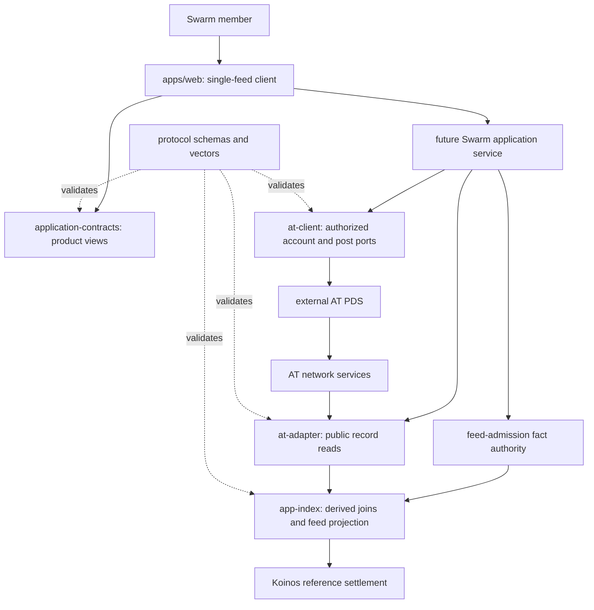
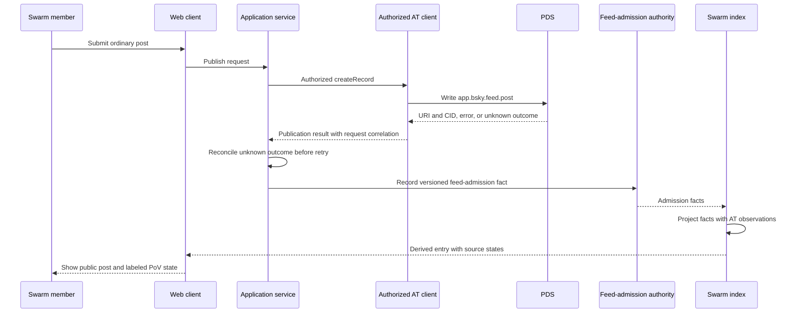
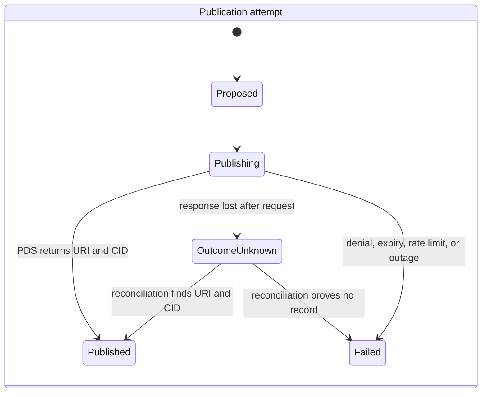
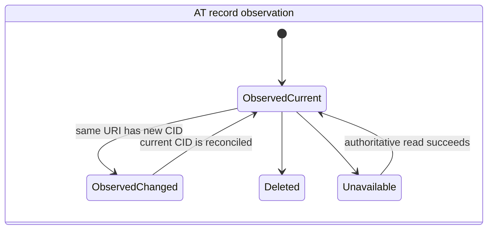
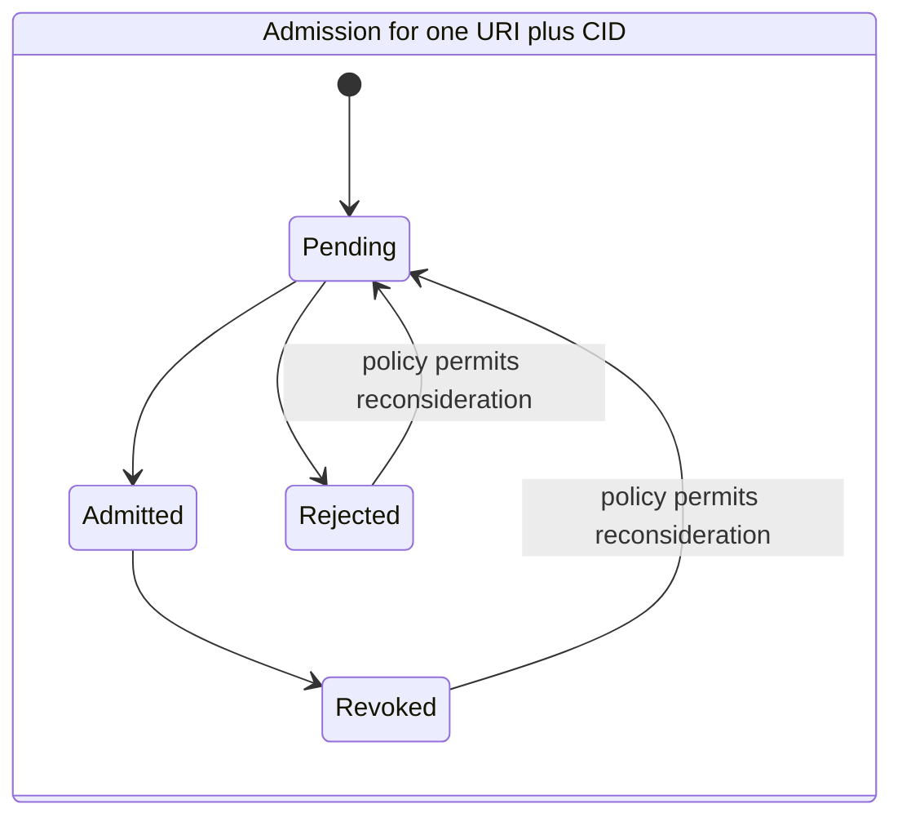
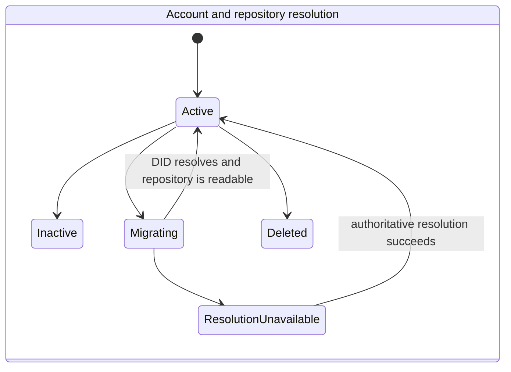

# Swarm Market Entry Foundation - Plan

## Goal Capsule

- **Objective:** Reorient the repository around one small, self-referential Swarm feed where newcomers can understand the product, preview ordinary posting and PoV evaluation, and find bounded implementation work without needing prior AT Protocol knowledge.
- **Product authority:** The user-confirmed direction in this plan outranks the older collaboration-preview plan. `WHITEPAPER.md` remains the mechanism reference. `docs/context/POV_PROJECT_CONTEXT.md` and `docs/context/POV_DECISION_LOG.md` remain the durable state after this plan updates them.
- **Execution profile:** Build a collaborator-ready foundation. Produce product framing, component contracts, representative fixtures, a single-feed web shell, contributor work packets, and verification. Do not implement live account provisioning, OAuth, PDS operations, live post publication, production moderation, or live token settlement.
- **Proof target:** A collaborator can clone the repository, run one coherent Swarm feed from explicit fixtures, trace an ordinary `app.bsky.feed.post` from publication result through feed admission and PoV display state, and select a bounded live-integration task.
- **Stop conditions:** Stop if implementation would require choosing unresolved PoV economics, storing user credentials in the client, presenting fixture state as live protocol state, or operating a production PDS. Record the dependency instead of inventing behavior.
- **Tail ownership:** The repository stays an open-source experiment and collaborator invitation. It is not a token launch, fundraise, investment product, public beta, or general-purpose social network.

---

## Product Contract

### Summary

Swarm should enter the market as one ordinary-looking social feed dedicated to building, testing, and critiquing Proof of Value.
People should be able to encounter the product without already having a Bluesky account or caring about AT Protocol.
Underneath the product, a Swarm account is an AT Protocol identity and an ordinary post is an `app.bsky.feed.post` record in that user's repository.
Swarm adds project-feed admission, ranking, upvotes, downvotes, and token-allocation views without claiming that AT Protocol supplies those product-specific layers.

This repository update is the foundation for that product direction.
It should be shareable as: “This is how I think we should bring Proof of Value to market. Here is the first product surface, the architecture underneath it, and the work that remains.”

### Problem Frame

The current repository leads with the paper and an ambitious cross-protocol proof.
Its built mockup contains two marketplaces and browser-local economics, while `apps/web` contains only a developer-preview placeholder.
Its AT adapter assumes public reads from existing authors or explicit record URIs.
That orientation does not explain how the first community forms when the intended users have no AT account and no reason to post about Proof of Value elsewhere.

The new wedge is self-referential.
The first useful content is the work of discussing, designing, testing, and building the product itself.
The product creates that venue first, and AT Protocol becomes infrastructure beneath the experience rather than an onboarding prerequisite or the marketing proposition.

### Key Decisions

- **One project-specific feed is the first product.** The initial feed is dedicated to contributions about Proof of Value. It does not wait for a relevant Bluesky discourse to appear. (session-settled: user-directed — chosen over aggregating existing Bluesky content: no useful external content pool exists yet.) Governs R1, R5, R6, R15.
- **The user-facing identity is a Swarm account.** A newcomer should not need a pre-existing Bluesky account or protocol knowledge. The target architecture backs the account with AT Protocol underneath. (session-settled: user-approved — chosen over Bluesky-first onboarding: the target user is unlikely to arrive with or value a Bluesky identity.) Governs R2, R3, R12.
- **Posts use the ordinary AT social-post record.** Swarm publishes `app.bsky.feed.post` rather than introducing a custom content collection for the first feed. (session-settled: user-directed — chosen over a custom Swarm record type: the first object should behave like an ordinary social post.) Governs R4, R7, R8, R9.
- **AT Protocol is canonical content infrastructure, not the whole product backend.** User repositories hold identity and posts. Swarm owns feed admission, ranking, PoV views, moderation policy, and derived indexes. Governs R7-R11, R13.
- **The repository foundation precedes live infrastructure.** This plan builds contracts, fixtures, boundaries, docs, and a coherent web shell. It does not conceal unfinished network paths behind simulated success. (session-settled: user-directed — chosen over implementing the full product now: the immediate goal is a shareable foundation that recruits help.) Governs R14-R19.
- **Existing protocol work remains supporting evidence.** The Koinos spike and older cross-protocol plan remain labeled groundwork. They do not define the market-entry sequence. Governs R10, R16, R18.

### Actors

- A1. **Newcomer:** discovers Swarm without an AT or Bluesky account and wants to read or participate with ordinary product language.
- A2. **Swarm member:** has a Swarm-created AT-backed identity, publishes ordinary posts, and evaluates other posts.
- A3. **Existing AT user:** may later connect an existing identity, but this is a compatibility path rather than the first onboarding requirement.
- A4. **Project maintainer:** curates the first cohort, handles abuse, operates or selects the PDS, and communicates system maturity.
- A5. **Prospective contributor:** clones the repository, runs the foundation, inspects boundaries, and chooses a bounded implementation unit.
- A6. **AT infrastructure:** provides DIDs, handles, repositories, blobs, record lifecycle, and network distribution.
- A7. **Swarm application services:** admit eligible posts, derive the project feed, join PoV state, and enforce product policy without becoming canonical content storage.
- A8. **Koinos reference settlement:** remains the proposed canonical financial path and existing feasibility work; live end-to-end settlement is deferred.

### Requirements

**Market-entry experience**

- R1. The repository presents one Swarm feed dedicated to ideas, questions, critiques, designs, code, experiments, and evidence about Proof of Value.
- R2. The product language presents registration as creating a Swarm account and does not require AT Protocol knowledge.
- R3. The target architecture gives each Swarm-created account a portable AT identity, while the foundation labels account creation as proposed until a real PDS path is proven.
- R4. The compose experience represents an ordinary social post and discloses that a published post is public AT Protocol data.
- R5. The feed supports visible upvote, downvote, and allocation states without requiring the foundation to settle unresolved economic parameters.
- R6. The feed teaches its purpose through the content and interface itself rather than requiring the white paper as a prerequisite.

**Canonical and derived data**

- R7. A published content record is an `app.bsky.feed.post` in the author's AT repository; Swarm does not make its application database the canonical copy.
- R8. Every published version is identified by a DID-based AT URI and observed CID so edits cannot silently change the object being evaluated.
- R9. Publication uncertainty, edit, deletion, account deactivation, account deletion, and account migration have explicit application states and reconciliation behavior; a retry must not create a duplicate public post when the original publication outcome is unknown.
- R10. PoV evaluation and allocation state remains separate from the content record and carries a provenance label such as design fixture, derived index, or canonical settlement.
- R11. A versioned feed-admission fact authority records admission and revocation decisions. Swarm's index projects those facts with canonical AT records, account events, retained lifecycle observations, and the selected PoV authority; the index is rebuildable and never claims authority over the underlying content or settled token state.

**Identity, authorization, and operations**

- R12. Account provisioning and member-authorized AT actions are separate authorities. Member OAuth binds the transaction, issuer, PDS metadata, and returned DID; uses least-privilege permissions for the required collection and action; and keeps one-time authorization material and token capabilities opaque and server-side. The web client holds neither provisioning authority, a PDS administrative credential, nor a broad shared signing key.
- R13. Before any account is provisioned, the account-hosting boundary defines custody, recovery and migration authority, separate registrable domains for the app and PDS, backups, PLC recovery keys, invite controls, spam controls, moderation and appeal roles, emergency actions, audit evidence, and user-visible deletion and retention behavior.
- R14. The foundation uses fixtures and contract tests for unimplemented network paths and labels them at the data source and interface, not only in prose.

**Collaboration readiness**

- R15. The root repository explains the market-entry thesis before the full mechanism and directs readers to one runnable product shell.
- R16. The older dual-marketplace mockup and cross-protocol plan remain available as vision and protocol-history artifacts, with clear supersession labels.
- R17. A contributor can identify component ownership, dependencies, open product decisions, security boundaries, and a bounded task without reconstructing earlier conversations.
- R18. Every component and roadmap item distinguishes implemented, simulated, proposed, blocked, and deferred work.
- R19. The repository provides automated checks for the new schemas, fixtures, package boundaries, web shell, internal links, and maturity labels.

### Key Flows

- F1. Create a Swarm account and reach the feed
  - **Trigger:** A1 chooses to participate without an existing AT account.
  - **Actors:** A1, A4, A6, A7
  - **Steps:** Swarm explains public posting and account portability; a future server-side provisioning authority creates the AT identity on an approved PDS; member authorization is established separately; the user receives an ordinary Swarm-facing session; the feed opens without protocol setup screens.
  - **Outcome:** The user experiences a Swarm account, while the system records the AT identity and authorization provenance needed for later recovery and migration.
  - **Covered by:** R2-R4, R12-R14
- F2. Publish a project contribution
  - **Trigger:** A2 submits text from the Swarm composer.
  - **Actors:** A2, A6, A7
  - **Steps:** The authorized AT client writes an `app.bsky.feed.post`; the PDS returns an AT URI and CID or leaves the outcome unknown; Swarm reconciles an unknown outcome before allowing resubmission; a versioned feed-admission fact is recorded separately; the derived index hydrates the record and displays its source state.
  - **Outcome:** One ordinary public AT post appears in the project feed without becoming a custom Swarm content object.
  - **Covered by:** R1, R4, R6-R8, R11-R12, R14
- F3. Evaluate and inspect a contribution
  - **Trigger:** A2 upvotes or downvotes a feed entry.
  - **Actors:** A2, A7, A8
  - **Steps:** The application identifies the exact URI and CID; it submits or simulates the evaluation through an explicitly labeled authority; the index joins the result to the entry; the UI shows score and allocation provenance.
  - **Outcome:** Readers can distinguish social content, derived ranking, and financial authority.
  - **Covered by:** R5, R8, R10-R11, R14, R18
- F4. Reconcile content or account lifecycle
  - **Trigger:** A post is edited or deleted, or an account is deactivated, deleted, suspended, or migrated.
  - **Actors:** A2, A4, A6, A7, A8
  - **Steps:** The index observes the lifecycle event and its current DID-to-PDS authority; the feed updates the content state; an evaluated CID is not overwritten by a newer CID or given an implied new admission decision; migration invalidates stale authorization and preserves DID-keyed history; settled historical evidence stays auditable while unavailable content is not rendered as current.
  - **Outcome:** The feed does not silently drift from the canonical repository or erase the provenance of prior evaluations.
  - **Covered by:** R8-R11, R13-R14, R18
- F5. Join as a technical collaborator
  - **Trigger:** A5 opens the repository from a shared link.
  - **Actors:** A5
  - **Steps:** The root README explains the wedge and current truth; the contributor starts the web shell; contract tests show canonical and derived boundaries; workstream documents name a bounded task and its proof.
  - **Outcome:** The collaborator can critique the approach or begin implementation without treating scaffolds as a working product.
  - **Covered by:** R15-R19

### Acceptance Examples

- AE1. **Covers R2-R4, R12, R14.** Given a visitor has no AT account, when they inspect the account flow in the foundation, then it uses Swarm language, discloses public AT-backed posting, shows the provisioning path as proposed, and never requests a Bluesky password or exposes a PDS administrative credential.
- AE2. **Covers R7-R9, R11, R14.** Given the publish fixture succeeds, when the fixture is validated and rendered, then it contains an `app.bsky.feed.post` collection, a DID-based AT URI, an observed CID, and a separate versioned feed-admission fact; given the network outcome is unknown, the UI prevents blind resubmission until reconciliation completes.
- AE3. **Covers R5, R8, R10, R14, R18.** Given a fixture-backed post has a displayed vote and pending allocation, when a reader opens its provenance, then the content source, feed-index source, and PoV source are labeled independently and no value is described as live settlement.
- AE4. **Covers R8-R9, R11.** Given an evaluated post's URI later resolves to a different CID during a pending allocation, when reconciliation runs, then the prior evaluation remains bound to the earlier CID and the new CID has a separate observed, admission, visibility, and evaluation-eligibility state; no state is inherited until the deferred edit policy permits it.
- AE5. **Covers R9-R11, R18.** Given a post is deleted, its PDS becomes unavailable, or its account becomes inactive or deleted, when the feed consumes that state, then it never renders retained text as current; it keeps a tombstone containing only the DID, URI, evaluated CID, lifecycle provenance, and PoV evidence until a later retention policy narrows that minimum.
- AE6. **Covers R1, R6, R15-R16.** Given a collaborator opens the root README and starts `apps/web`, when they follow the primary path, then they see one project-specific feed and not the older marketplace switcher.
- AE7. **Covers R15-R19.** Given a collaborator wants to help with AT onboarding, publishing, feed indexing, PoV evaluation, or moderation, when they open the workstream guide, then each track names its owner boundary, prerequisites, non-goals, acceptance scenarios, and verification surface.
- AE8. **Covers R13-R14, R18.** Given no production PDS has been selected or operated, when docs and UI describe account creation, then they mark it proposed and link to the operational gate instead of claiming that Swarm accounts already exist.

### Success Criteria

- The root repository tells one coherent market-entry story: join Swarm, post about building Proof of Value, evaluate contributions, and help implement the missing layers.
- `apps/web` renders one self-referential feed from representative contracts and fixtures, with compose and account entry points that cannot be mistaken for live network actions.
- Shared schemas and tests prove the separation among AT account state, ordinary post publication, feed admission, content lifecycle, and PoV provenance.
- Architecture and operations docs explain which infrastructure AT Protocol supplies and which product responsibilities Swarm retains.
- The old dual-marketplace mockup and Koinos proof work remain discoverable and accurately labeled as vision and protocol groundwork.
- A prospective contributor can run the repository checks and choose a bounded workstream from documented evidence.

### Scope Boundaries

**Included in this foundation**

- Reframe `README.md`, `ARCHITECTURE.md`, `ROADMAP.md`, `CONTRIBUTING.md`, and durable context around the single-feed wedge.
- Add a concise market-entry product brief and an AT account-hosting decision gate.
- Define framework-neutral schemas and fixtures for Swarm account state, ordinary post publication, feed admission, content lifecycle, and provenance.
- Add an authorized AT-client boundary as a tested interface scaffold, separate from the public read adapter.
- Turn `apps/web` into a runnable single-feed product shell backed by explicit fixtures.
- Update existing component READMEs and contributor workstreams to match the new dependency graph.
- Preserve and relabel the older mockup, plan, protocol proof, and Koinos spike.

**Deferred to follow-up work**

- Selecting, deploying, or operating a production PDS.
- Live invite issuance, account provisioning, OAuth callbacks, session storage, account recovery, and account migration.
- Live `app.bsky.feed.post` writes, blob uploads, edits, deletes, replies, notifications, and firehose or Tap ingestion.
- Production persistence, ranking, moderation queues, labeling, spam defenses, rate limiting, observability, backups, and disaster recovery.
- A live Koinos vote-lock-settlement-claim round trip, wallet custody, sponsorship, and economic parameter selection.
- Adopting Koinos Nicknames as an optional display alias for a verified Koinos settlement address; its contract, deployment, lifecycle, and resolver must pass the deferred integration gate first.
- Connecting an existing AT or Bluesky identity as an alternative onboarding path.
- Public launch, creator recruitment, analytics, and growth experiments.

**Outside this product's identity**

- A general-purpose Bluesky client or general social network.
- A custom Swarm content protocol when ordinary AT posts satisfy the first product.
- Token sales, promised monetary value, exchanges, fundraising, or an investment thesis.
- Multiple marketplaces in the first product.

### Dependencies and Assumptions

- The first real cohort can be invite-only while account operations and moderation are immature.
- Ordinary `app.bsky.feed.post` records are public. Product copy and tests must preserve that expectation.
- The PDS is the source of truth for the user's repository, but Swarm still needs a derived application database for feed admission, moderation, ranking, and PoV joins.
- DID-based AT URIs remain stable locators across handle changes. The observed CID identifies the exact evaluated version.
- The current Koinos spike is valid feasibility evidence only. It does not prove live settlement or the market-entry product.
- Points, fixtures, and projected allocation values are acceptable in the foundation only when their source and noncanonical status are visible.

### Open Questions

These questions are deferred because this foundation can preserve the decision boundary without choosing product behavior:

- **Deferred:** Which contributions qualify for the first feed beyond the broad categories in R1?
- **Deferred:** Is feed admission automatic for every post created in Swarm, or moderated before publication to the project feed?
- **Deferred:** Does an edited CID inherit feed admission, visibility, or evaluation eligibility, or require a new admission decision?
- **Deferred:** Who receives the first invites, and what moderation authority does that cohort accept?
- **Deferred:** What does a downvote mean, and what protections limit retaliation or coordinated suppression?
- **Deferred:** Does the first interactive evaluation use labeled points, a local simulation, or a live Koinos testnet path?
- **Deferred:** Is Koinos Nicknames sufficiently verifiable and maintained to display a human-readable alias beside a resolved Koinos address, without making that alias an identity or authorization authority?
- **Deferred:** What period, budget, allocation curve, and token semantics should the first live experiment use?
- **Deferred:** Which PDS host and recovery model can meet the operational gate in R13?
- **Deferred:** What final retention and privacy policy applies to tombstones after post deletion, account deletion, or settlement?

### Sources

**Repository evidence**

- `README.md`
- `ARCHITECTURE.md`
- `ROADMAP.md`
- `CONTRIBUTING.md`
- `docs/context/POV_PROJECT_CONTEXT.md`
- `docs/context/POV_DECISION_LOG.md`
- `docs/plans/2026-07-20-001-feat-parallel-prototype-foundation-plan.md`
- `packages/at-adapter/README.md`
- `packages/application/README.md`
- `packages/app-index/README.md`
- `apps/web/app/page.js`
- `design/mockup/README.md`

**AT Protocol authority**

- [Self-hosting AT Protocol](https://atproto.com/guides/self-hosting)
- [Going to production](https://atproto.com/guides/going-to-production)
- [Account lifecycle](https://atproto.com/guides/account-lifecycle)
- [OAuth specification](https://atproto.com/specs/oauth)
- [AT Protocol permissions](https://atproto.com/specs/permission)
- [Permission sets](https://atproto.com/guides/permission-sets)
- [OAuth patterns](https://atproto.com/guides/oauth-patterns)
- [Reads and writes](https://atproto.com/guides/reads-and-writes)
- [Creating a post](https://docs.bsky.app/docs/tutorials/creating-a-post)
- [AT URI scheme](https://atproto.com/specs/at-uri-scheme)

**Koinos naming context**

- [Koinos ecosystem directory](https://koinos.io/ecosystem)
- [Koinos Mana documentation](https://docs.koinos.io/overview/mana/)

---

## Planning Contract

### Key Technical Decisions

- KTD1. **Treat the PDS as an external infrastructure dependency.** Do not implement a PDS inside this monorepo. Document the account-hosting contract and require a separate operational proof before live onboarding. Reserve separate registrable domains for the app/OAuth client and the PDS; do not place login or session pages on the PDS or blob-serving origin. This limits the foundation to boundaries the repository can verify and follows the official separation between data-level PDS infrastructure and application-level AppView services. Governs R3, R7, R13-R14.
- KTD2. **Keep the canonical/derived split explicit.** The user's AT repository owns identity and ordinary post records. A feed-admission fact authority records append-only, versioned admission and revocation facts. `@pov/app-index` projects those facts with observations, moderation inputs, ranking projections, and joined PoV views. Do not create a separate package for the admission authority in this foundation. The derived index must be rebuildable. Governs R7-R11.
- KTD3. **Add `@pov/at-client` for authorized user actions and keep provisioning separate.** Keep `@pov/at-adapter` read-only and provenance-focused. The new package defines member-session and post-publication ports without implementing network transport; it represents provisioning outcomes from a distinct server-side operator boundary but never carries provisioning authority. This prevents member OAuth, privileged account creation, and public reads from collapsing into one credential path. Governs R3-R4, R7-R9, R12-R14.
- KTD4. **Use secure, collection-specific authorization.** Future user-facing writes request the minimum actions for `app.bsky.feed.post`, with separate blob permissions only when media is implemented. The OAuth transaction uses PKCE, pushed authorization requests, DPoP and nonce handling, one-time state, a fixed redirect allowlist, authoritative issuer discovery, returned-`sub` DID verification, and rejection of undeclared granted scopes. Do not base the design on a broad shared PDS credential or the transitional generic scope. Governs R4, R12-R13.
- KTD5. **Bind evaluation views to URI plus CID.** A DID-based AT URI identifies the logical record and the observed CID identifies the evaluated version. Editing creates a new version with separate admission and evaluation states; it never mutates or inherits the provenance of an earlier evaluation unless a later accepted policy says so. Governs R8-R11.
- KTD6. **Model lifecycle, authority, and uncertainty as data.** Shared facts represent publication pending, outcome unknown, live, changed, deleted, unavailable, invalid, account-inactive, and migrated states. Lifecycle observations carry the subject DID, authoritative PDS resolution at observation time, repository revision or commit when available, observation time, and reconciliation precedence. A stable client request or record-key correlation supports reconciliation without blind republishing. Old-PDS, stale, or out-of-order observations cannot restore or overwrite newer authoritative state. Governs R9, R11, R13-R14.
- KTD7. **Make the web shell fixture-first and truthfully inert.** `apps/web` consumes the same framework-neutral application view intended for later live services. Compose, account, vote, and allocation interactions use disabled or explicit preview behavior where no authority exists. Governs R1-R6, R10, R14-R15, R18.
- KTD8. **Use the single-feed shell as the repository front door.** Reuse visual primitives from `design/mockup` where helpful, but do not import its two-marketplace state model or treat browser-local calculations as protocol behavior. (session-settled: user-approved — chosen over preserving the dual-marketplace prototype as the primary demo: the first market is the project itself.) Governs R1, R5-R6, R15-R16.
- KTD9. **Keep Koinos as a parallel reference track.** Preserve the spike and cross-protocol artifacts. Define PoV provenance in the shared view so a later Koinos implementation can replace fixture or projected state without changing the feed's content model. Evaluate Koinos Nicknames only as an optional display alias beside a verified settlement address: never use a nickname as the Swarm identity, AT identity, record key, or authorization input. Adoption requires confirming the source and license, deployed contract and code hash, upgrade authority, name ownership and transfer rules, normalization and collision behavior, resolver availability, network cost, and SDK support. Governs R5, R10, R16, R18.
- KTD10. **Record maturity at every boundary.** Schemas, fixtures, package READMEs, UI labels, roadmap entries, and contributor work packets use the repository's implemented/simulated/proposed/blocked/deferred vocabulary. A root disclaimer alone is insufficient. Governs R3, R10, R14-R19.
- KTD11. **Use contract-first contributor packets.** Each follow-up workstream starts from checked-in contracts, fixtures, acceptance examples, and a verification surface. No packet asks a contributor to invent product policy that remains in Open Questions. Governs R17-R19.

### High-Level Technical Design

The diagrams describe responsibility and lifecycle. They are directional guidance, not implementation syntax.

#### Component topology

AT supplies account repositories and public records.
Swarm supplies the product feed and its policy.
Koinos remains the proposed settlement authority, not a prerequisite for the foundation shell.

#### Publication and feed-admission sequence

The real network steps remain unimplemented in this foundation.
Fixtures must preserve the same success and failure boundaries so the later adapter does not require a new product contract.

#### Composable lifecycle facts

The application composes these facts into one view. An old CID can remain admitted and evaluated while a newer CID is observed but pending a separate admission decision. A DID can migrate PDS without changing the current content version. A deleted record never supplies a live post body.

The application keeps evaluation provenance for the observed CID even when the current feed no longer renders that version as live.
The foundation tombstone retains only DID, URI, evaluated CID, lifecycle provenance, and PoV evidence; the final retention and privacy policy remains a later operational decision.

### System-Wide Impact

- **Identity and security:** The pivot introduces account provisioning, OAuth, session, recovery, and migration boundaries that the current read-only architecture does not contain. No browser code or fixture may normalize administrative credential custody.
- **Data lifecycle:** Content is canonical on a PDS while admission facts and PoV state are separate authorities and the feed is derived. Reconciliation must cover partial success, version change, deletion, account inactivity, PDS migration, out-of-order observations, and stale indexes.
- **Product truthfulness:** The repository will contain a polished shell before live infrastructure. Source-state labels therefore become part of the application contract and test surface.
- **Moderation and abuse:** Swarm-created accounts make the project an account provider and community operator, not only a client. Invite controls, abuse handling, rate limits, labelers, and takedown policy become launch gates.
- **Operations:** A PDS hostname is difficult to change after active accounts exist. Separate registrable domains, custody and break-glass authority, backups, PLC recovery keys, object storage, monitoring, and disaster recovery require a deliberate choice before real users are provisioned.
- **Protocol compatibility:** Ordinary posts preserve compatibility with AT clients and network distribution. Swarm-specific feed admission and PoV state must remain outside the post record so other clients can ignore them safely.
- **Contributor workflow:** The new foundation changes the sequencing authority from the July parallel-prototype plan to this market-entry plan. Existing unit IDs remain historical within the old file and are not renumbered or rewritten.

### Sequencing

1. U1 establishes the durable product truth and new repository front door.
2. U2 defines the shared data contracts and fixtures that all code-bearing units consume.
3. U3 creates the authorized AT boundary against U2 without live credentials or transport.
4. U4 builds the single-feed shell against U2 fixtures and U3's boundary states.
5. U5 aligns the read adapter, application service, and index responsibilities with the canonical/derived split.
6. U6 packages the work for contributors after the actual boundaries and shell exist.
7. U7 adds cross-repository checks and reconciles all maturity labels before the foundation is shared.

### Risks and Dependencies

- **PDS operations are underestimated.** Account hosting brings security, backup, recovery, abuse, and migration duties. Mitigation: keep live provisioning deferred and require `docs/operations/AT_ACCOUNT_HOSTING.md` to define the proof and launch gates.
- **Account custody enables impersonation or lockout.** A host-controlled password reset, shared write credential, recovery key, or break-glass path could transfer effective control of a user's identity. Mitigation: require a custody threat-model matrix, prohibit shared impersonation credentials, and prove recovery and migration in drills before provisioning users.
- **Unsafe domain topology exposes sessions.** PDS-hosted blobs can share their origin with sensitive pages if domains are collapsed. Mitigation: require separate registrable domains and verify DNS, TLS, client metadata, redirects, and blob origins before account creation.
- **“Portable” becomes misleading.** Protocol portability does not make recovery or migration operationally free. Mitigation: product copy says AT-backed and portable only where a tested recovery/migration path exists.
- **Public posting surprises users.** An ordinary AT post is public and network-distributable. Mitigation: put disclosure in R4's UI contract and test AE1 rather than burying it in terms.
- **Feed moderation cannot erase public AT records.** Excluding a post from Swarm does not retract it from its repository or the wider network. Mitigation: distinguish PDS account action, record deletion, and feed exclusion in contracts, UI copy, incident roles, and abuse-response drills.
- **Index drift corrupts meaning.** A post may publish successfully while its response, feed-admission write, or hydration fails. Mitigation: model publication, outcome uncertainty, and admission as separate facts; correlate retries; let the admission authority accept facts independently of the index; and include reconciliation vectors that recover without republishing.
- **Edits rewrite evaluated content.** An AT URI can point to a newer record CID. Mitigation: KTD5 binds every evaluation view to the observed CID and tests changed-version behavior.
- **Fixture polish overstates readiness.** A coherent shell can look functional before the protocols are wired. Mitigation: KTD10 requires maturity at each boundary and U7 scans for unsupported live claims.
- **Unresolved economics leak into code.** The mockup contains specific budgets, vote counts, and formulas. Mitigation: move those values into explicit design fixtures and keep them out of canonical contracts until product decisions are accepted.
- **The older plan competes for authority.** Contributors could follow the July sequence and rebuild the wrong wedge. Mitigation: U1 marks it historical and U6 makes this plan the active roadmap source without deleting prior evidence.
- **External API evolution:** AT OAuth and permissions continue to evolve. Mitigation: bind the plan to official granular-permission docs and isolate transport behind `@pov/at-client`.
- **Fixtures or diagnostics leak credentials.** OAuth-shaped data can escape through JSON fixtures, snapshots, logs, environment variants, or build output. Mitigation: reject token and private-key fields in serializable contracts, redact upstream errors, scan tracked and generated files, and allowlist public configuration only.

### Live Account Production Gates

These gates do not block the collaborator-ready foundation. They block provisioning any real Swarm account:

- The selected PDS and OAuth client pass a conformance test for issuer discovery, PKCE, pushed authorization, DPoP and nonce handling, returned-DID binding, redirect allowlisting, scope enforcement, key rotation, and incident revocation.
- The app/OAuth client and PDS use separate registrable domains, with reviewed DNS, TLS, client metadata, callback URLs, redirect behavior, and blob-serving origins.
- The custody matrix names who controls recovery keys, password resets, deletion, migration, support escalation, and break-glass access; Swarm cannot impersonate a member with a shared write credential.
- Account recovery, deletion, PDS migration, stale-old-PDS rejection, and lifecycle replay are exercised in controlled drills with approved retention behavior.
- The invite-only cohort passes an abuse-response tabletop covering invite revocation, reporting, emergency feed action, PDS-level action, notice, appeal, and the inability to retract already-public AT records through feed moderation.
- Deployment logs, provider errors, environment configuration, fixtures, snapshots, and build artifacts pass credential and redaction checks.

---

## Implementation Units

### U1. Reframe the durable product story

- **Goal:** Make the single self-referential Swarm feed the repository's primary market-entry story while preserving older work as labeled history.
- **Requirements:** R1-R6, R15-R18; F5; AE6, AE8; KTD8-KTD10.
- **Files:** `README.md`, `ARCHITECTURE.md`, `ROADMAP.md`, `docs/product/SWARM_MVP.md`, `docs/context/POV_PROJECT_CONTEXT.md`, `docs/context/POV_DECISION_LOG.md`, `docs/context/POV_MVP_CONTEXT.md`, `docs/source-audit.md`, `docs/plans/2026-07-20-001-feat-parallel-prototype-foundation-plan.md`, `design/mockup/README.md`, `docs/architecture-diagram-spec.md`.
- **Approach:** Lead `README.md` with the product wedge, what can be run, and how to help. Put the detailed market-entry proposition, demo story, first-cohort assumptions, learning goals, and open product decisions in `docs/product/SWARM_MVP.md`. Update durable context and the decision log with the accepted session decisions. Add a supersession note to the July plan and label the dual-marketplace mockup as a vision artifact without rewriting their historical content.
- **Patterns:** Follow the truth-state vocabulary in `docs/context/POV_PROJECT_CONTEXT.md` and the source discipline in `docs/source-audit.md`.
- **Test Scenarios:**
  - The root path directs a new reader to one Swarm feed before the white paper and clearly says what is implemented.
  - The product brief uses ordinary participation language and does not describe a token launch, investment, or general social network.
  - The July plan and dual-marketplace mockup remain accessible and identify the newer plan as the market-entry authority.
  - The context packet and decision log record all four session-settled decisions without converting deferred economic or moderation choices into decisions.
- **Verification:** A documentation-link test resolves all new paths; a maturity-label audit finds an explicit state for every claimed component; `npm run lint` passes for any documentation tooling touched.
- **Dependencies:** None.

### U2. Define Swarm account, publication, and feed contracts

- **Goal:** Create the smallest stable contract set that separates canonical AT data, Swarm application facts, and PoV provenance.
- **Requirements:** R3-R14, R17-R19; F1-F4; AE1-AE5, AE7-AE8; KTD1-KTD2, KTD4-KTD6, KTD9-KTD11.
- **Files:** `spec/protocol/swarm-account.schema.json`, `spec/protocol/post-publication.schema.json`, `spec/protocol/feed-entry.schema.json`, `spec/protocol/content-lifecycle.schema.json`, `spec/vectors/swarm-feed/`, `packages/protocol/src/`, `packages/protocol/test/swarm-feed-contract.test.ts`, `packages/protocol/package.json`, `packages/protocol/README.md`, `packages/application-contracts/src/`, `packages/application-contracts/test/swarm-feed-view.test.ts`, `packages/application-contracts/package.json`, `packages/application-contracts/README.md`, `package.json`, `tsconfig.base.json`.
- **Approach:** Define runtime-validated schemas for publication request/result, request correlation, authorization outcome, URI-plus-CID content reference, current-record observation, per-CID versioned feed admission, account/PDS resolution, minimal tombstone evidence, and source provenance. Keep these as composable facts, not a combined lifecycle enum. Admission facts carry `admissionId`, subject URI plus observed CID, decision state, policy version, actor class or system authority, observation time, reversible reason category, and idempotency key without choosing the admission policy. Lifecycle observations carry the DID, authoritative PDS resolution, repository revision or commit when available, observation time, and ordering evidence. Serializable schemas explicitly reject authorization codes, access or refresh tokens, DPoP private keys, PDS administrator fields, wallet keys, and raw upstream error bodies. Add positive and negative vectors for success, denial, outcome unknown, partial success, callback mismatch, scope escalation, new CID, deletion, inactivity, migration, rate limiting, unavailable reads, and out-of-order observations. Extend application contracts with a single-feed view that joins these facts without flattening their authorities.
- **Patterns:** Extend the schema-source versus TypeScript-package split described in `spec/protocol/README.md` and `packages/protocol/README.md`. Preserve the existing provenance vocabulary where it remains valid and add states only when F1-F4 require them.
- **Test Scenarios:**
  - A valid publication result accepts `app.bsky.feed.post`, a DID-based AT URI, CID, and source state while rejecting a handle-based canonical URI.
  - A publication success with failed feed admission remains representable and does not claim the post is visible in Swarm.
  - A timed-out publication remains outcome-unknown until reconciliation finds the original record or proves no record exists; retry correlation prevents a duplicate.
  - A changed record retains the evaluated CID and current observed CID with separate admission and evaluation states.
  - An old CID can remain admitted and evaluated while a newer CID is observed but pending admission, and an account can migrate PDS without a content-version change.
  - Deleted, unavailable, inactive, and migrated accounts produce distinct valid lifecycle states, including DID resolution to a new PDS while repository reads are unavailable.
  - An old-PDS observation, stale fixture, or out-of-order event cannot restore deleted or inactive content or overwrite a newer authoritative repository state.
  - A tombstone validates only with the minimum historical reference and cannot contain cached post text or embeds.
  - An application view cannot serialize OAuth codes or tokens, DPoP private keys, PDS admin fields, wallet keys, raw provider errors, or an unlabeled allocation value.
  - All golden fixtures validate through both JSON Schema and the exported TypeScript/runtime contract.
- **Verification:** `npm test --workspace=@pov/protocol` and `npm test --workspace=@pov/application-contracts` pass; `npm run typecheck` passes; malformed vectors fail for the intended rule.
- **Dependencies:** U1 for settled vocabulary and product scope.

### U3. Add the authorized AT client boundary

- **Goal:** Give contributors a safe, explicit seam for future Swarm account and ordinary-post work without implementing live PDS or OAuth behavior.
- **Requirements:** R2-R4, R7-R9, R12-R14, R17-R19; F1-F2, F4; AE1-AE2, AE4, AE8; KTD1, KTD3-KTD6, KTD10-KTD11.
- **Files:** `packages/at-client/package.json`, `packages/at-client/README.md`, `packages/at-client/src/`, `packages/at-client/test/contract.test.ts`, `docs/operations/AT_ACCOUNT_HOSTING.md`, `.env.example`, `package.json`, `tsconfig.base.json`.
- **Approach:** Add `@pov/at-client` as a framework-neutral port package. Represent account-provisioning status from a distinct server-side authority, opaque member-authorized capability state, ordinary post publication, and outcome reconciliation. Define safe OAuth outcome categories for one-time state, PKCE, pushed authorization, DPoP nonce, issuer, returned DID, scope, expiry, and revocation checks without implementing callbacks or storing token material. Provide deterministic fake adapters for tests, but no network SDK, callback route, credential storage, provisioning secret, or PDS deployment. Document the PDS evaluation gate with a custody threat-model matrix, separate-domain topology, allowed origins and callbacks, account-invite model, user versus host recovery control, migration initiation and confirmation, operator break-glass access, audit trail, backups, PLC recovery keys, moderation and appeals, spam controls, rate limits, observability, deletion/retention policy, and exit evidence.
- **Patterns:** Mirror `@pov/at-adapter`'s explicit state handling while keeping public observation and authorized mutation in separate packages. Follow the Product Contract's AT Protocol authority sources for self-hosting, production, account lifecycle, OAuth, and permissions.
- **Test Scenarios:**
  - The port requests only the post collection and intended actions represented by the contract.
  - Reused or mismatched state, wrong issuer, returned-DID mismatch, missing or invalid DPoP nonce, undeclared granted scope, and actor-DID mismatch fail authorization without exposing provider data.
  - Session denial, expiry, revocation, and unavailable PDS return explicit states without publishing or logging credentials.
  - Publication returns success only with both URI and CID; a partial response fails closed.
  - A lost response after a committed write returns outcome-unknown and blocks blind resubmission until reconciliation looks up the expected URI derived from the preallocated record key and completes.
  - A test fake can reproduce publish-success/admission-pending without coupling the package to the app index.
  - Provisioning denied before identity creation and identity-created/session-unavailable remain distinct outcomes.
  - Provisioning requested, identity created, user recovery established, and hosting proof incomplete remain distinct states; the live gate proves the host cannot retain an impersonating password or shared user-write credential after member handoff, and no fake adapter models either.
  - Package exports do not expose an administrative account-creation secret or browser-serializable refresh token.
- **Verification:** `npm test --workspace=@pov/at-client`, `npm run typecheck`, and `npm run lint` pass; contract tests cover OAuth transaction failures; static configuration rejects an app/OAuth origin and PDS origin on the same registrable domain; repository scanning finds no fixture credential.
- **Dependencies:** U2.

### U4. Build the single-feed product shell

- **Goal:** Replace the developer-placeholder page with the repository's primary product artifact: one fixture-backed feed for building Proof of Value.
- **Requirements:** R1-R6, R8, R10, R14-R16, R18-R19; F2-F3, F5; AE2-AE3, AE6; KTD5, KTD7-KTD10.
- **Files:** `apps/web/app/page.js`, `apps/web/app/layout.js`, `apps/web/app/globals.css`, `apps/web/components/`, `apps/web/lib/`, `apps/web/fixtures/`, `apps/web/test/feed-foundation.test.js`, `apps/web/package.json`. The historical `design/mockup` remains a read-only visual reference labeled by U1.
- **Approach:** Reuse suitable visual language from the mockup but build the active shell in `apps/web`. Render a single project-purpose header, ordinary composer, feed cards, account entry point, vote controls, allocation context, and source-state detail from U2 application fixtures. Seed posts that model useful first-feed contributions: proposal, critique, implementation note, experiment, and request for evidence. Keep unimplemented interactions inert or explicitly preview-only. Remove the marketplace switcher from the active experience; do not delete it from the historical mockup.
- **Patterns:** Use the existing `design/mockup/components/PostCard.js`, `VoteBar.js`, and styling as visual references. Consume application fixtures through a small web data boundary rather than importing protocol schema internals into components.
- **Test Scenarios:**
  - The home page renders exactly one project feed and no marketplace switcher.
  - Each card shows author, ordinary post content, content source, vote state, and allocation source without describing fixture data as live.
  - The account entry point explains that the future Swarm account is AT-backed and posting is public, while remaining nonfunctional in this foundation.
  - The composer does not report success or add a canonical post when live publication is unavailable.
  - Vote controls can demonstrate state locally only when labeled simulated and cannot be mistaken for settled token state.
  - Empty, unavailable, deleted, changed-CID, and admission-pending fixtures render distinct recovery or explanation states.
  - An outcome-unknown publication warns the user not to resubmit until reconciliation completes, and an admission rejection does not claim the public AT post was erased.
  - An excluded post explains that Swarm removed it from this feed without implying that the public AT record was deleted from its repository or the wider network.
- **Verification:** `npm test --workspace=@pov/web`, `npm run build --workspace=@pov/web`, `npm run lint`, and `npm run typecheck` pass; a browser smoke check confirms the page hierarchy, labels, keyboard access, and responsive layout.
- **Dependencies:** U2. U3 can proceed in parallel after U2 because the shell consumes contracts, not transport.

### U5. Align read, index, and application boundaries

- **Goal:** Update the existing middle-layer scaffolds so contributors understand how a Swarm-published post becomes a derived feed entry and how lifecycle reconciliation works.
- **Requirements:** R7-R14, R17-R19; F2-F4; AE2-AE5, AE7; KTD2-KTD6, KTD9-KTD11.
- **Files:** `packages/at-adapter/README.md`, `packages/application/README.md`, `packages/app-index/README.md`, `packages/application-contracts/README.md`, `ARCHITECTURE.md`, `docs/architecture-diagram-spec.md`, `spec/vectors/swarm-feed/`.
- **Approach:** Revise component ownership so `@pov/at-adapter` observes public records and lifecycle, `@pov/at-client` owns authorized member operations, the server-side account host owns provisioning, the feed-admission authority records append-only admission facts, `@pov/app-index` projects those facts with observations and rebuildable joins, and `@pov/application` assembles the product view. Specify reconciliation after unknown publication outcome, publish/admission partial failure, changed CID, deletion, account inactivity, migration, stale or out-of-order reads, and index delay. The application reads the projection and does not require synchronous index completion. Keep Koinos projections distinct from content and feed authorities.
- **Patterns:** Preserve the existing inward dependency direction around `@pov/protocol` and the application read-contract boundary. Replace the selected-author/explicit-URI MVP assumption only where the newer product direction supersedes it.
- **Test Scenarios:**
  - Every lifecycle fixture has one owning component and one observable downstream state.
  - A successful AT write followed by an index failure is recoverable without republishing the record.
  - Replaying admission facts retains their policy version, actor class, reason category, timestamp, and idempotency while producing the same current projection.
  - Rebuilding the index from the same canonical facts produces the same feed admission and provenance view.
  - A deleted record cannot be hydrated from a stale fixture and presented as live.
  - A deleted record can rebuild an auditable tombstone from lifecycle and admission facts but never repopulates a live body from cache or fixture text.
  - After migration, an old PDS or out-of-order event cannot restore a revoked admission, stale body, deleted record, or inactive account state.
  - Koinos fixture or projected state never becomes the content source of truth.
- **Verification:** U2 vector tests cover the documented reconciliation scenarios; a dependency-boundary check finds no write-client import in `@pov/at-adapter` or canonical-content claim in `@pov/app-index`.
- **Dependencies:** U2-U4.

### U6. Create bounded collaborator workstreams

- **Goal:** Turn the foundation into a credible invitation to help build, implement, test, and challenge the product.
- **Requirements:** R15-R19; F5; AE6-AE8; KTD10-KTD11.
- **Files:** `CONTRIBUTING.md`, `ROADMAP.md`, `docs/workstreams/README.md`, `docs/workstreams/at-account-and-publishing.md`, `docs/workstreams/feed-index-and-lifecycle.md`, `docs/workstreams/pov-evaluation-and-settlement.md`, `docs/workstreams/moderation-and-operations.md`, `docs/workstreams/product-and-research.md`, `README.md`.
- **Approach:** Replace the July unit map as the active contributor entry point with five bounded tracks. Each packet names current state, goal, prerequisites, owned files, upstream contracts, non-goals, acceptance examples, verification, open decisions, and coordination points. The account and moderation packet defines invite issuance and revocation, quotas, audit evidence, reporting and response channels, PDS-level versus feed-level authority, emergency action, notice and appeal posture, and a limited-cohort readiness review. Preserve the Koinos track as one workstream rather than the prerequisite for all market-entry work. Give that track a bounded Koinos Nicknames evaluation gate and require any future UI to resolve and display the underlying address alongside the alias. State contribution terms and review expectations before soliciting code.
- **Patterns:** Follow the current `CONTRIBUTING.md` practice of naming responsibility and dependency direction, but point every track at this plan's R/F/AE/KTD contracts instead of the superseded U1-U9 sequence.
- **Test Scenarios:**
  - Each workstream is independently understandable and names at least one objective verification result.
  - No workstream authorizes a contributor to settle an Open Question through code.
  - Account and moderation workstreams name production safety gates before live users.
  - The moderation packet requires a tabletop abuse-response exercise and states that feed exclusion cannot retract a public AT record.
  - The PoV track distinguishes mechanism design, local contract proof, Harbinger proof, and live product settlement.
  - The PoV track treats a Koinos nickname as an optional address label, documents the adoption evidence required by KTD9, and rejects nickname-only authorization or identity linkage.
  - All referenced files and contract IDs resolve.
- **Verification:** Documentation-link and ID-reference checks pass; a clean-clone contributor smoke follows the root path through setup, web shell, contracts, and one work packet without private context.
- **Dependencies:** U1-U5 so packets describe the repository that exists rather than a speculative topology.

### U7. Add foundation-wide truth and verification gates

- **Goal:** Make the repository safe to share by proving that its code, contracts, docs, and maturity claims agree.
- **Requirements:** R14-R19; F5; AE6-AE8; KTD10-KTD11.
- **Files:** `scripts/verify-foundation.mjs`, `tests/foundation/`, `package.json`, `.github/workflows/ci.yml`, `README.md`, `ROADMAP.md`, `docs/context/POV_PROJECT_CONTEXT.md`.
- **Approach:** Add a repository verification command that runs schema/vector tests, package tests, web build, internal-link checks, workstream ID checks, maturity-claim checks, and credential hygiene. Extend CI with the command. Scan tracked fixtures, snapshots, local-environment variants, test output, and generated build output for disallowed token or private-key fields. Keep only allowlisted public configuration in examples, ignore local environment variants, and require safe diagnostic codes instead of raw provider bodies. Add focused tests that reject obsolete claims such as “AT integration is built,” “Swarm accounts are live,” or the dual-marketplace mockup being the MVP. Finish with a manual product-truth audit against the Goal Capsule and Product Contract.
- **Patterns:** Extend the root script and CI structure already present in `package.json` and `.github/workflows/ci.yml`. Keep tests deterministic and credential-free.
- **Test Scenarios:**
  - A missing schema vector, broken internal link, unresolved plan ID, or unlabeled fixture causes the foundation verification to fail.
  - CI requires no PDS, OAuth secret, AT network, Koinos credential, or external write.
  - Token-, authorization-code-, DPoP-key-, PDS-admin-, and wallet-key-shaped fields fail fixture and generated-output scanning; public configuration examples remain allowlisted.
  - The active README, roadmap, context packet, web shell, and component READMEs agree on implemented versus deferred states.
  - The Koinos spike still builds and its existing test remains isolated from the new market-entry foundation checks.
  - Generated build artifacts and abandoned experimental code are absent from the final diff.
- **Verification:** `npm run verify:foundation`, `npm run lint`, `npm run typecheck`, `npm test`, `npm run build`, `npm run contracts:build`, and `npm run contracts:test` pass in a clean checkout.
- **Dependencies:** U1-U6.

---

## Verification Contract

| Gate | Applies to | Command or review | Required result |
|---|---|---|---|
| Foundation contract | U2-U7 | `npm run verify:foundation` | Schemas, vectors, links, IDs, maturity labels, and package boundaries pass. |
| JavaScript and TypeScript tests | U2-U7 | `npm test` | All workspace tests pass without network credentials. |
| Static types | U2-U5, U7 | `npm run typecheck` | Shared contracts and package exports have no type errors. |
| Lint | U1-U7 | `npm run lint` | Code and repository checks pass with zero warnings. |
| Web production build | U4, U7 | `npm run build` | The single-feed shell builds from a clean checkout. |
| Koinos preservation | U1, U5-U7 | `npm run contracts:build` and `npm run contracts:test` | The existing spike still builds and its event test passes. |
| Product shell smoke | U4, U7 | Manual browser review at desktop and mobile widths | One feed renders; source labels, inert controls, keyboard navigation, empty/error states, and public-post disclosure are visible. |
| Security boundary review | U2-U3, U5, U7 | Inspect serialized views, fixtures, exports, environment examples, origin configuration, and safe diagnostics | OAuth transaction failures are representable; app and PDS origins remain separated; no authorization code, token, DPoP private key, administrative PDS field, wallet key, raw provider error, or unrestricted write path reaches browser or fixtures. |
| Product-truth audit | U1, U4, U6-U7 | Compare repository claims with Goal Capsule, R14-R18, and current evidence | Implemented, simulated, proposed, blocked, and deferred claims agree across the repo. |
| Clean-clone collaborator smoke | U6-U7 | Follow `README.md` and `CONTRIBUTING.md` in a clean checkout | A contributor can start the shell, run checks, and choose a workstream without private context. |

The implementation may add narrower package commands as the scaffolds become runnable.
It must preserve the root gates above as the shareable completion evidence.

---

## Definition of Done

- The Goal Capsule and all R1-R19 requirements are traceable to at least one completed unit and acceptance scenario.
- The root README and runnable web shell present one project-specific Swarm feed as the first product.
- The product shell never claims that fixture-backed account, publishing, voting, or allocation behavior is live.
- Shared schemas and tests represent account state, ordinary post publication, separate feed admission, URI-plus-CID versioning, content lifecycle, and PoV provenance.
- `@pov/at-client` exists as a safe tested boundary with no live transport, user secret, or PDS administrative capability.
- Account provisioning authority, member OAuth capability, feed-admission authority, and the derived app index remain distinct and have negative boundary tests.
- Architecture and operational docs explain both the infrastructure gained from AT Protocol and the responsibilities Swarm must still operate.
- The plan names the custody, domain, OAuth conformance, migration, abuse-response, and credential-hygiene gates that block real account provisioning.
- The AT read adapter, application service, app index, and Koinos reference path have non-overlapping canonical responsibilities.
- The older dual-marketplace mockup and July plan remain available, intact, and labeled as historical vision or protocol groundwork.
- Contributor workstreams are bounded by contracts and do not ask implementers to decide unresolved product policy.
- All Verification Contract gates pass in a clean checkout without external write credentials.
- Durable context and the decision log record the accepted pivot and preserve remaining open questions.
- Documentation, fixtures, tests, generated assets, and code contain no abandoned attempts or contradictory maturity claims.

### Unit Completion Map

- U1 is done when the durable product story and historical labels agree with the user-confirmed pivot.
- U2 is done when positive and negative vectors prove every canonical, derived, lifecycle, and provenance boundary.
- U3 is done when the authorized AT port and PDS operations gate are explicit, tested, and credential-free.
- U4 is done when the active web app presents one truthful, coherent feed from shared fixtures.
- U5 is done when each middle-layer component owns one clear part of publication, observation, admission, reconciliation, or assembly.
- U6 is done when a collaborator can choose a bounded workstream without inventing missing product decisions.
- U7 is done when CI and a clean-clone smoke prove the repository is internally consistent and safe to share.
